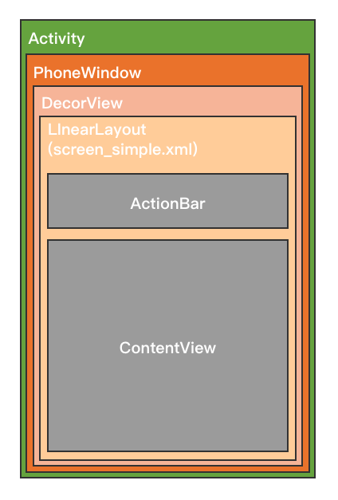

<!-- toc -->

# 一、前言
>本文主要讲述**View 被添加到屏幕窗口上的源码流程**
源码基于 **Android API 28**


# 二、 源码追踪 

1. 我们一般在`Activity`里的`void onCreate(@Nullable Bundle savedInstanceState)`方法中使用`setContentView()`方法添加自己的布局，代码如下：

    ```java
    //MyActivity.java
    protected void onCreate(@Nullable Bundle savedInstanceState) {
        super.onCreate(savedInstanceState);
        setContentView(R.layout.testlayout);
    }
    ```

    <br>
2. 追踪`setContentView()`方法到`Activity`类中，看到如下代码：

    ```java
    package android.app;
    //Activity.java
    public void setContentView(@LayoutRes int layoutResID) {
        getWindow().setContentView(layoutResID);
        initWindowDecorActionBar();
    }
    ```

    其中`getWindow()`方法返回一个继承抽象类`Window`的`PhoneWindow`对象。
    **注意：**`PhoneWindow`是抽象类`Window`的唯一实现类。
    <br>
3. 继续追踪`setContentView()`方法到`PhoneWindow`类中，看到如下代码：

    ```java
    package com.android.internal.policy;
    //PhoneWindow.java
    public void setContentView(int layoutResID) {
        if (mContentParent == null) {
            installDecor();
        } else if (!hasFeature(FEATURE_CONTENT_TRANSITIONS)) {
            mContentParent.removeAllViews();
        }

        if (hasFeature(FEATURE_CONTENT_TRANSITIONS)) {
            final Scene newScene = Scene.getSceneForLayout(mContentParent, layoutResID,
                    getContext());
            transitionTo(newScene);
        } else {
            mLayoutInflater.inflate(layoutResID, mContentParent);
        }
        ...
    }
    ```

    其中重点关注两条代码：
    * `installDecor()`
    * `mLayoutInflater.inflate(layoutResID, mContentParent)`
    <br>
4. 追踪`installDecor()`方法，看到如下代码：

    ```java
    package com.android.internal.policy;
    //PhoneWindow.java
    private void installDecor() {
        mForceDecorInstall = false;
        if (mDecor == null) {
            mDecor = generateDecor(-1);
            ...
        } else {
            mDecor.setWindow(this);
        }
        if (mContentParent == null) {
            mContentParent = generateLayout(mDecor);
            ...
        }
        ...
    }

    ```

    其中重点关注两条代码：
    * `mDecor = generateDecor(-1)`
    * `mContentParent = generateLayout(mDecor)`
    <br>
5. 追踪`generateDecor()`方法，看到如下代码：

    ```java
    package com.android.internal.policy;
    //PhoneWindow.java
    protected DecorView generateDecor(int featureId) {
        // System process doesn't have application context and in that case we need to directly use
        // the context we have. Otherwise we want the application context, so we don't cling to the
        // activity.
        Context context;
        if (mUseDecorContext) {
            Context applicationContext = getContext().getApplicationContext();
            if (applicationContext == null) {
                context = getContext();
            } else {
                context = new DecorContext(applicationContext, getContext());
                if (mTheme != -1) {
                    context.setTheme(mTheme);
                }
            }
        } else {
            context = getContext();
        }
        return new DecorView(context, featureId, this, getAttributes());
    }
    ```

    该方法主要返回一个`DecorView`，`DecorView`继承了`FrameLayout`
    <br>
6. 追踪`generateLayout()`方法，看到如下代码：

    ```java
    package com.android.internal.policy;
    //PhoneWindow.java
    protected ViewGroup generateLayout(DecorView decor) {
        ...
        mDecor.onResourcesLoaded(mLayoutInflater, layoutResource);
        ViewGroup contentParent = (ViewGroup)findViewById(ID_ANDROID_CONTENT);
        ...
        return contentParent;
    }
    ```

    其中重点关注两条代码：
    * mDecor.onResourcesLoaded(mLayoutInflater, layoutResource);
        其中`layoutResource`值为根据特性返回的不同的布局文件资源 id
    * ViewGroup contentParent = (ViewGroup)findViewById(ID_ANDROID_CONTENT)
    <br>
7. 追踪`onResourcesLoaded(mLayoutInflater, layoutResource)`方法，看到如下代码：

    ```java
    package com.android.internal.policy;
    //DecorView.java
    void onResourcesLoaded(LayoutInflater inflater, int layoutResource) {
        ...
        mDecorCaptionView = createDecorCaptionView(inflater);
        final View root = inflater.inflate(layoutResource, null);
        if (mDecorCaptionView != null) {
            if (mDecorCaptionView.getParent() == null) {
                addView(mDecorCaptionView,
                        new ViewGroup.LayoutParams(MATCH_PARENT, MATCH_PARENT));
            }
            mDecorCaptionView.addView(root,
                    new ViewGroup.MarginLayoutParams(MATCH_PARENT, MATCH_PARENT));
        } else {
            // Put it below the color views.
            addView(root, 0, new ViewGroup.LayoutParams(MATCH_PARENT, MATCH_PARENT));
        }
        mContentRoot = (ViewGroup) root;
        ...
    }
    ```

    该方法将`layoutResources`中传递的布局文件解析成名为`root`的View，然后将该View添加到`DecorView`中
8. 之后回到第6条中`ViewGroup contentParent = (ViewGroup)findViewById(ID_ANDROID_CONTENT)`，这条语句根据固定id获取一个容器，并在`generateLayout`方法中将该容器返回。该ID值如下：

    ```java
    package android.view;
    //Window.java
    public abstract class Window {
        ...
        /**
        * The ID that the main layout in the XML layout file should have.
        */
        public static final int ID_ANDROID_CONTENT = com.android.internal.R.id.content;
        ...
    }
    ```

    该ID是主容器的ID值，且必然存在
    
9. 接着返回第3条中，经过`installDecor`方法之后`mContentParent`即为第8条中获取的容器。之后通过`mLayoutInflater.inflate(layoutResID, mContentParent)`将`layoutResID`解析成View再放到`mContentParent`中。即将开发者所写的布局文件加载到名为`ID_ANDROID_CONTENT`的容器中。`inflate`源码如下：

    ```java
    package android.view;

    public abstract class LayoutInflater {
        ...
        public View inflate(XmlPullParser parser, @Nullable ViewGroup root) {
            return inflate(parser, root, root != null);
        }
        ...
    }
    ```

# 三、 总结

1. `Activity`: 每个`Activity`持有一个`PhoneWindow`的对象，而一个`PhoneWindow`对象持有一个`DecorView`的实例。
2. `Window`: 是一个抽象类，提供了绘制窗口的一组通用API，他的唯一实例就是`PhoneWindow`。
3. `PhoneWindow`: 是 `Window`继承实现类，实现`Window`各方法，它持有一个`DecorView`对象，该`DecorView`对象是所有`Activity`的根`View`。`Activity`可通过`getWindow（）`方法获取`Window`对象。
4. `DecorView`: 继承自`FrameLayout`，是`PhoneWindow`的内部类，当`DecorView`接受到来自`Activity`中的`setContentView(int resId)`传递过来的布局id后通过`inflater`把布局资源转换为一个View，然后把这个布局View添加到自身中，是所有应用窗口的根View。

5. 层级图如下：
    

    ```xml
    <?xml version="1.0" encoding="utf-8"?>
    <!--
    //device/apps/common/assets/res/layout/screen_simple.xml
    This is an optimized layout for a screen, with the minimum set of features enabled.
    -->
    <LinearLayout xmlns:android="http://schemas.android.com/apk/res/android"
        android:layout_width="match_parent"
        android:layout_height="match_parent"
        android:fitsSystemWindows="true"
        android:orientation="vertical">
        <ViewStub android:id="@+id/action_mode_bar_stub"
                android:inflatedId="@+id/action_mode_bar"
                android:layout="@layout/action_mode_bar"
                android:layout_width="match_parent"
                android:layout_height="wrap_content"
                android:theme="?attr/actionBarTheme" />
        <FrameLayout
            android:id="@android:id/content"
            android:layout_width="match_parent"
            android:layout_height="match_parent"
            android:foregroundInsidePadding="false"
            android:foregroundGravity="fill_horizontal|top"
            android:foreground="?android:attr/windowContentOverlay" />
    </LinearLayout>
    ```