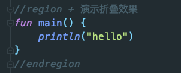
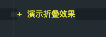
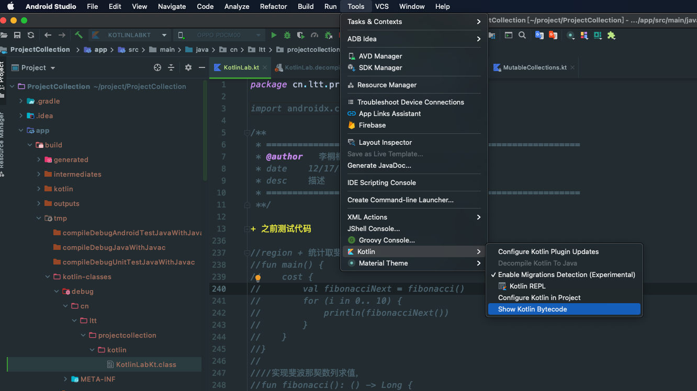
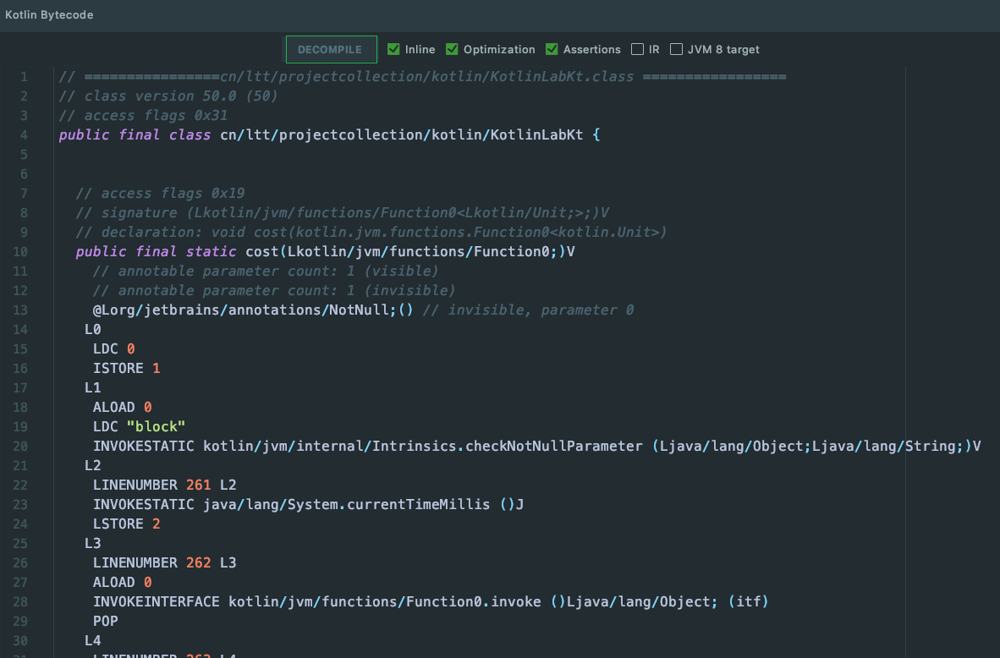
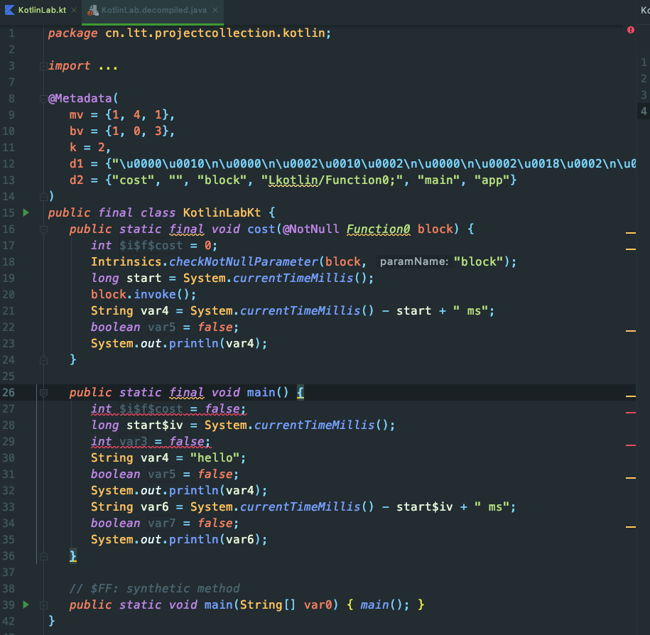
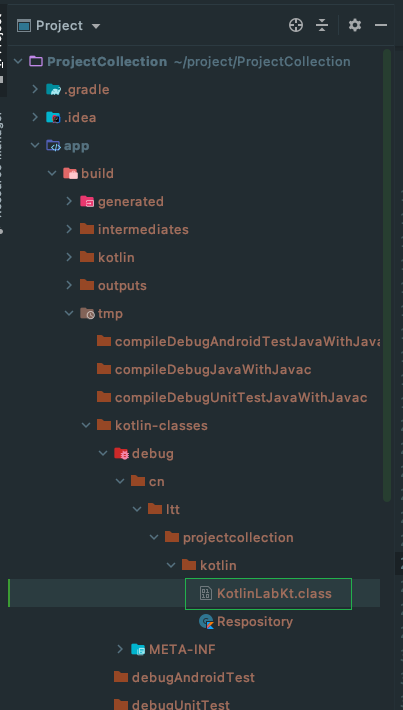
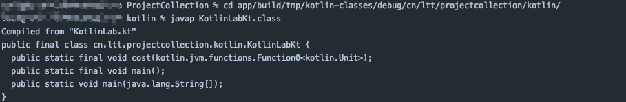

<!-- toc -->

# 一、前言

1. 本文主要讲述**Kotlin 函数进阶**
2. **Kotlin官网：[https://kotlinlang.org/](https://kotlinlang.org/)**
3. **Kotlin中文官网：[https://www.kotlincn.net/](https://www.kotlincn.net/)**
4. Kotlin 学习系列文章：
    * 
    * 
    * 

# 二、高阶函数

## 1. 高阶函数定义

**高阶函数：** **参数类型**包含函数类型或**返回值类型**为函数类型的函数

```kotlin
//参数类型包含函数类型
fun needsFunction(block: () -> Unit) {
    block()
}
//返回值类型是函数类型
fun returnFunctions(): () ->Long {
    return {System.currentTimeMillis()}
}
```

## 2. 常见的高阶函数

### 1. `forEach`函数

```kotlin
public inline fun IntArray.forEach(action: (Int) -> Unit): Unit {
    for (element in this) action(element)
}
```

`forEach()`函数作用是迭代集合，把每个元素取出来**进行了某些操作**。

`forEach()`作为`IntArray`类的扩展方法，该方法接收一个函数`action`作为参数，这个函数入参是一个`Int`, 返回`Unit`。在`forEach()`里直接调用函数`action`的`invoke()`方法。

### 2. `map`函数

```kotlin
public inline fun <R> IntArray.map(transform: (Int) -> R): List<R> {
    return mapTo(ArrayList<R>(size), transform)
}
```

`map()`函数作用是迭代集合，把每个元素取出来但是**把元素转为另外的元素，并组成一个`List`**

`map()`函数作为`IntArray`类的扩展方法，该方法接收一个函数`transform`作为参数，这个函数入参是一个`Int`类型，返回一个`R` *(R 为泛型）* 类型。在`map()`里将函数`transform`作为一个参数传入另一个高阶函数`mapTo()`

## 3. 高阶函数调用

### 1. 传递函数引用

在`kotlin`中，函数也是普通的类型，与`Int`、`String`等没什么区别

作为入参的函数可以直接传递函数引用，而不一定要传`lambda`表达式

```kotlin
val a : IntArray = IntArray(3)
a[0] = 4
a.forEach(::println)
```

如上，将函数`println`的引用传入，因`forEach()`函数入参类型为`(Int) -> Unit`而`println`函数有一个重载方法类型为`(Int) -> Unit`，所以这样写完全可以。

### 2. 使用表达式

按高阶函数的声明来看，应该在入参位置放一个函数

```kotlin
a.forEach({ println("element $it")})
```

**若高阶函数的入参函数只有一个或最后一个入参是高阶函数，则可将`lambda`表达式移到小括号外面。**
**只有一个`lambda`表达式作为参数时可省略小括号**
**只有一个参数的`lambda`表达式的形参默认是`it`**

```kotlin
//将lambda表达式外移
a.forEach() { println("element $it") }
```

```kotlin
//省略小括号
a.forEach { println("element $it") }
```

### 3. 高阶函数应用

**统计指印斐波那契数列的时间**

```kotlin

//region + 统计取斐波那契数列前11位所需时间
fun main() {
    cost {
        val fibonacciNext = fibonacci()
        for (i in 0.. 10) {
            println(fibonacciNext)
        }
    }
}

//实现斐波那契数列求值，
fun fibonacci(): () -> Long {
    var first = 0L
    var second = 1L
    return {
        val next = first + second
        val current = first
        first = second
        second = next
        current
    }
}

fun cost(block: () -> Unit) {
    val start = System.currentTimeMillis()
    block()
    println("${System.currentTimeMillis() - start} ms")
}
//endregion

```

打印结果如下：

```kotlin
0
1
1
2
3
5
8
13
21
34
55
3 ms
```

打印出斐波那契数列前 11 项，耗时 3ms。

说明：

1. `cost`函数作用是统计函数`block`运行所需时间，`cost`入参为函数`block`，`block`函数不需要入参，且返回值为`Unit`

2. `fibonacci()`函数实现了斐波那契数列取值，它返回一个`lambda`表达式，该表达式不需要入参，但返回了一具`Long`类型数值

# 三、内联函数

## 1. 定义

使用关键字 **`inlin`** 修饰的函数即为内联函数
**编译时会将内联函数内定义的函数直接内联到真正的调用处**

```kotlin
public inline fun IntArray.forEach(action: (Int) -> Unit): Unit {
    for (element in this) action(element)
}
fun main() {
    val ints = intArrayOf(1,2,3,4)
    ints.forEach {
        println("Hello $it")
    }
}
```

如上，调用内联函数`forEach`其实是将函数`forEach`内定义的函数内联到调用处，如下所示：

```kotlin
fun main() {
    val ints = intArrayOf(1,2,3,4)
    for (element in ints) {
        println("Hello $element")
    }
}
```

## 2. 高阶函数更适合定义为内联函数

内联函数的作用：**减少了函数调用**

```kotlin
fun main() {
    cost {
        println("hello")
    }
}
fun cost(block: () -> Unit) {
    val start = System.currentTimeMillis()
    block()
    println("${System.currentTimeMillis() - start} ms")
}
```

如上定义了一个以`lambda`表达式为入参的高阶函数`cost`, 而`lambda`是匿名函数的语法糖，每次调用函数`cost`时都会创建他的入参函数`block`，所以可以为高阶函数`cost`添加关键字`inline`修饰。

```kotlin
fun main() {
    cost {
        println("hello")
    }
}
inline fun cost(block: () -> Unit) {
    val start = System.currentTimeMillis()
    block()
    println("${System.currentTimeMillis() - start} ms")
}
```

这样在编译时会将函数`cost`内联到原始调用处，如下所示编译后`class`文件：

```kotlin
public final class KotlinLabKt {
   public static final void cost(@NotNull Function0 block) {
      long start = System.currentTimeMillis();
      block.invoke();
      String var4 = System.currentTimeMillis() - start + " ms";
      System.out.println(var4);
   }

   public static final void main() {
      long start$iv = System.currentTimeMillis();
      String var4 = "hello";
      System.out.println(var4);
      String var6 = System.currentTimeMillis() - start$iv + " ms";
      System.out.println(var6);
   }
}

```

如此，没有了调用函数`cost`的开销，也没有了创建`lambda`表达式的开销。

## 3. 内联高阶函数的`return`

### 1. local return

`kotlin`会给`lambda`表达式加一个**默认的标签**，标签名就是 **@加上调用`lambda`表达式的高阶函数名一致**。

```kotlin
fun main() {
    val ints = intArrayOf(1,2,3,4)
    ints.forEach {
        if (it == 3) return@forEach
        println("element: $it")
    }
}
```

打印结果为：

```kotlin
element: 1
element: 2
element: 4
```

如上所示，先定义了一个有四个元素的`Int`数组，之后遍历数组，在元素为 3 时不执行打印语句。即`return@forEach`只起一次作用，类似于`continue`语句，它等价于如下语句：

```kotlin
fun main() {
    val ints = intArrayOf(1,2,3,4)
    for (element in ints) {
        if (element == 3) continue
        println("element: $element")
    }
}
```

### 2. non-local return

若`return`不加标签，且在高阶函数的入参表达式中`return`了，则是直接退出了调用高阶函数所在的外部函数
如下所示：

```kotlin
fun main() {
    val ints = intArrayOf(1,2,3,4)
    ints.forEach {
        if (it == 3) return@forEach
        println("element: $it")
    }
    for (element in ints) {
        if (element == 3) continue
        println("element: $element")
    }
}
```

打印结果为：

```kotlin
element: 1
element: 2
element: 4
element: 1
element: 2
element: 4
```

但是，若去掉标签`@forEach`，只留`return`语句，则打印结果如下：

```kotlin
element: 1
element: 2
```

即`return`直接作用到了函数`main()`上，从函数`main()`上返回

### 3. 不允许`non-local return`

若高阶函数的入参表达式的调用处与定义处不在同一个调用上下文，有可能存在不合法的`non-local return`

```kotlin
inline fun Runnable(block: () -> Unit): Runnable {
    return object : Runnable {
        override fun run() {
            block()
        }
    }
}
```

定义如上代码时，在语句`block()`处报错`Can't inline 'block' here: it may contain non-local returns. Add 'crossinline' modifier to parameter declaration 'block`，即此处不允许出现`non-local return`。

关键字`crossinline`，表示表达式禁止`nono-local return`，但是表达式还可以内联，但要在声明的形参表达式前加上该关键字。
关键字`noinline`，表示禁止形参表达式被内联

```kotlin
inline fun Runnable(corssinline block: () -> Unit): Runnable {
    return object : Runnable {
        override fun run() {
            block()
        }
    }
}
inline fun Runnable(noinline block: () -> Unit): Runnable {
    return object : Runnable {
        override fun run() {
            block()
        }
    }
}
```

## 4. 内联属性

没有`backing-field`的属性的`getting/setting`可以被内联

```kotlin
var pocket: Double = 0.0
var monkey: Double
    inline get() = pocket
    inline set(value) {
        pocket = value
    }

fun main() {
    monkey = 5.0
}
```

反编译后代码如下：

```java
private static double pocket;

   public static final double getPocket() {
      return pocket;
   }

   public static final void setPocket(double var0) {
      pocket = var0;
   }

   public static final double getMonkey() {
      return getPocket();
   }

   public static final void setMonkey(double value) {
      setPocket(value);
   }

   public static final void main() {
      double value$iv = 5.0D;
      setPocket(value$iv);
   }
   // $FF: synthetic method
   public static void main(String[] var0) {
      main();
   }
```

可以看到执行语句`monkey = 5.0`时直接调用了方法`setPocket()`，而不是调用`monkey`的`setMonkey`方法

## 5. 内联函数的限制

1. `public/protected`的内联方法只能访问对应类的`public`成员
2. 内联函数的内联函数参数不能被存储（赋值给变量）
3. 内联函数的内联函数参数只能传递给其它内联函数参数

即：
1. `public`只能访问`public`
2. 内联只能访问内联
3. 内联函数作为参数不能被存

# 四、几个实用的函数

## 1. 函数简单说明

|高阶函数名|介绍|说明|
|--|--|--|
|let|val r = X.let{x ->R}|将 receiver 作为参数调用指定的函数 [block] 并返回其结果|
|run|val r = X.run{this: X ->R}|以 receiver 作为接收者调用指定的函数 [block] 并返回其结果|
|also|val x = X.also{x -> Unit}|将 receiver 作为参数调用指定的函数 [block] 并返回 receiver|
|apply|val x = X.apply{this: x -> Unit}|将 receiver 作为接收者调用指定的函数 [block]，并返回 receiver|
|use|val r = Closeable.use{c -> R}|在 Closeable 资源上执行给定的 [block] 函数，然后无论是否引发异常，都正确地将其关闭。|
|with|with(X, X.() -> R)|以给定的 [receiver] 作为接收者调用指定的函数 [block]，并返回其结果|

## 2. 函数的实现

### 1. `let`函数

```kotlin
@kotlin.internal.InlineOnly
public inline fun <T, R> T.let(block: (T) -> R): R {
    contract {
        callsInPlace(block, InvocationKind.EXACTLY_ONCE)
    }
    return block(this)
}
```

### 2. `run`函数

```kotlin
@kotlin.internal.InlineOnly
public inline fun <T, R> T.run(block: T.() -> R): R {
    contract {
        callsInPlace(block, InvocationKind.EXACTLY_ONCE)
    }
    return block()
}
```

### 3. `also`函数

```kotlin
@kotlin.internal.InlineOnly
@SinceKotlin("1.1")
public inline fun <T> T.also(block: (T) -> Unit): T {
    contract {
        callsInPlace(block, InvocationKind.EXACTLY_ONCE)
    }
    block(this)
    return this
}
```

### 4. `apply`函数

```kotlin
@kotlin.internal.InlineOnly
public inline fun <T> T.apply(block: T.() -> Unit): T {
    contract {
        callsInPlace(block, InvocationKind.EXACTLY_ONCE)
    }
    block()
    return this
}
```

### 5. `use`函数

```kotlin
@InlineOnly
@RequireKotlin("1.2", versionKind = RequireKotlinVersionKind.COMPILER_VERSION, message = "Requires newer compiler version to be inlined correctly.")
public inline fun <T : Closeable?, R> T.use(block: (T) -> R): R {
    contract {
        callsInPlace(block, InvocationKind.EXACTLY_ONCE)
    }
    var exception: Throwable? = null
    try {
        return block(this)
    } catch (e: Throwable) {
        exception = e
        throw e
    } finally {
        when {
            apiVersionIsAtLeast(1, 1, 0) -> this.closeFinally(exception)
            this == null -> {}
            exception == null -> close()
            else ->
                try {
                    close()
                } catch (closeException: Throwable) {
                    // cause.addSuppressed(closeException) // ignored here
                }
        }
    }
}
```

### 6. `with`函数

```kotlin
@kotlin.internal.InlineOnly
public inline fun <T, R> with(receiver: T, block: T.() -> R): R {
    contract {
        callsInPlace(block, InvocationKind.EXACTLY_ONCE)
    }
    return receiver.block()
}
```

`with`函数可以让我们创建一个以变量作为上下文的代码块，这样就不需要每次使用它时重复它的名字。
`with`可以简单理解为“有了”，“有了变量 X”。这样代码也显得简洁。

## 实例

```kotlin
class Person(var name: String, var age: Int)

fun main() {
    val person = Person("Lee", 18)
    person.let(::println)
    person.run(::println)

    val person2 = person.also {
        it.name = "Lee2"
    }

    val person3 = person.apply {
        name = "Lee3"
    }

    with(person) {
        name = "Lee4"
    }

    File("build.gradle").inputStream().reader().buffered()
            .use {
                println(it.readLines())
            }
}
```

# 五、集合变换与序列

## 1. 遍历集合通常使用循环

### 1. for i ...

```kotlin
fun main() {
    for (i in 1.. 10) {
        println(i)
    }
}
```

### 2. for each ...

```kotlin
val ints = intArrayOf(1,2,3,3,4,5)
for (e in ints) {
    println(e)
}
```

### 3. forEach ...

```kotlin
ints.forEach {
    println(it)
}
```

注意：该方式不能`continue`或者`break`

## 2. 集合的映射操作

|函数名|说明|
|--|--|
|filter|保留满足条件的元素|
|map|集合中的所有元素一一映射到其它元素构成新集合|
|flatMap|集合中的所有元素一一映射到新集合并合并这些集合得到新集合|

### 1. filter 操作

**功能：** 将集合 a 内所有满足条件的元素生成一个新集合 b


示例如下：

```kotlin
val list = arrayListOf<Int>(1,2,3,4,5,6)
val list2 = list.filter { it % 2 == 0 }
println(list.joinToString())
println(list2.joinToString())
```

打印结果为：

```kotlin
1, 2, 3, 4, 5, 6
2, 4, 6
```

`java 8`中有类似的操作：

```java
List<Integer> list = Arrays.asList(1,2,3,4,5,6);
List<Integer> list2 = list.stream().filter( e -> e % 2 == 0).collect(Collectors.toList());
```

**说明：**

1. `filter`操作不会操作原来的集合而是创建一个新的集合
2. `java`中是先将`list`转为`stream`流，再进行`filter`筛选操作
3. `kotlin`中也有与`java`类似的先转换再筛选的操作：

    ```kotlin
    list.asSequence().filter{it % 2 == 0}
    ```

    说明：

    1. 先将集合转换为懒序列再将序列进行`filter`筛选操作
    2. 与将集合直接进行`filter`操作的区别只在于是*懒汉式*还是*饿汉式*

**ArrayList 的 filter 操作源码：**

```kotlin
public inline fun <T> Iterable<T>.filter(predicate: (T) -> Boolean): List<T> {
    return filterTo(ArrayList<T>(), predicate)
}
public inline fun <T, C : MutableCollection<in T>> Iterable<T>.filterTo(destination: C, predicate: (T) -> Boolean): C {
    for (element in this) if (predicate(element)) destination.add(element)
    return destination
}
```

## 3. map 操作

**功能：** 将集合 a 内的所有元素进行一个操作得到新的元素集合


示例如下：

```kotlin
val list = arrayListOf<Int>(1,2,3,4,5,6)
val list2 = list.map { it * 2 }
println(list.joinToString())
println(list2.joinToString())
```

打印结果：

```kotlin
1, 2, 3, 4, 5, 6
2, 4, 6, 8, 10, 12
```

`java`中若要使用`map`操作，要先将集合转为流 *(stream)*，示例如下：

```java
List<Integer> list = Arrays.asList(1,2,3,4,5,6);
List<Integer> list2 = list.stream().map( e -> e % 2).collect(Collectors.toList());
```

**说明：**

1. `map`操作也是创建一个 ussr 的集合，集合中的元素是原集合元素进行一个操作映射出来的
2. `kotlin`中也有与`java`类似的先转换再映射的操作：

    ```kotlin
    list.asSequence().map{it % 2}
    ```

    说明：

    1. 先将集合转换为懒序列再将序列进行`map`筛选操作
    2. 与将集合直接进行`map`操作的区别只在于是*懒汉式*还是*饿汉式*

**ArrayList 的 map 操作源码：**

```kotlin
public inline fun <T, R> Iterable<T>.map(transform: (T) -> R): List<R> {
    return mapTo(ArrayList<R>(collectionSizeOrDefault(10)), transform)
}
public inline fun <T, R, C : MutableCollection<in R>> Iterable<T>.mapTo(destination: C, transform: (T) -> R): C {
    for (item in this)
        destination.add(transform(item))
    return destination
}
```

### **`java`中`steam()`和`kotlin`中的`asSequence()`对比：**

#### 1. java 中 steam() 后再变换集合

```java
List<Integer> list = Arrays.asList(1,2,3,4);
list.stream()
        .filter(e -> {
            System.out.println("filter:" + e);
            return e % 2 == 0;
        })
        .map(e -> {
            System.out.println("map:" + e);
            return e * 2;
        })
        .forEach(e -> {
            System.out.println("forEach:" + e);
        });
```

打印结果：

```java
filter:1
filter:2
map:2
forEach:4
filter:3
filter:4
map:4
forEach:8
```

**说明：**

1. 先定义一个只有四个元素的整型列表，之后将列表转为流，再筛选出偶数，再通过乘以 2 映射成一个新集合，最后打印新集合元素
2. 从打印结果可以看出，会先通过`filter`判断元素是否为偶数：奇数不会再往下执行；若是偶数，则该元素会一直往下执行，最后打印出来，然后再判断下一个元素是否为偶数
3. `java`中的`steam()`是懒序列

#### 2. kotlin 中 asSequence() 后再变换集合

```kotlin
val list = arrayListOf<Int>(1, 2, 3, 4)
list.asSequence()
        .filter {
            println("filter:$it")
            it % 2 == 0
        }.map {
            println("map:$it")
            it * 2
        }.forEach {
            println("forEach:$it")
        }
```

打印结果：

```kotlin
filter:1
filter:2
map:2
forEach:4
filter:3
filter:4
map:4
forEach:8
```

**说明：**

1. 定义一个只有四个元素的整数集合，之后将列表转为`sequence()`，再筛选出偶数，再通过乘以 2 映射成一个新集合，最后打印新集合元素
2. 打印结果与`java`中的`steam()`结果完全一致，执行逻辑也一致。
3. **`kotlin`中的`asSequence()`也是懒序列，只有在需要时才会执行变换，如果不需要则只是个公式，不会执行。若把`forEach()`操作去掉，则不会有打印信息**

#### 3. `kotlin`中直接对集合进行变换

```kotlin
list.filter {
        println("filter:$it")
        it % 2 == 0
    }.map {
        println("map:$it")
        it * 2
    }.forEach {
        println("forEach:$it")
    }
```

打印结果为：

```kotlin
filter:1
filter:2
filter:3
filter:4
map:2
map:4
forEach:4
forEach:8
```

**说明：**

1. 该段代码对集合`list`进行了三个操作`filter`、`map`、`forEach`，只有**当列表里所有元素都执行完一个操作之后，才会执行下一个操作**。
2. **`kotlin`中直接对集合进行变换是饿汉式的，不管需要不需要都会执行变换，若把`forEach()`操作去掉，也会有打印信息**。
3. `RxJava`中的`Obserable`是*懒汉式的*

## 3. flatMap 变换

**功能：** 将一个集合 a 内的每个元素通过某个操作得到一个集合，最后将每个元素映射的集合拼接成一个新集合


如图所示：转换操作是创建一个长度为原集合对应元素值大小的`Int`数组，该数组元素由`index * 2`构成

示例如下：

```kotlin
list.flatMap {
        0 until it
    }.joinToString().let(::println)
```

打印结果为：

```kotlin
0, 0, 1, 0, 1, 2, 0, 1, 2, 3
```

**说明：**

1. `map`操作是将集合里每个元素映射成一个新元素，而`flatMap`操作是**将集合里的每个元素映射成一个新集合**
2. `flatMap`操作需要是的`Iterable`类型的数据，而`0 until it`生成的一个`IntRange`，该类型实现了`Iterable`

**ArrayList 的 flatMap 操作源码：**

```kotlin
public inline fun <T, R> Iterable<T>.flatMap(transform: (T) -> Iterable<R>): List<R> {
    return flatMapTo(ArrayList<R>(), transform)
}
public inline fun <T, R, C : MutableCollection<in R>> Iterable<T>.flatMapTo(destination: C, transform: (T) -> Iterable<R>): C {
    for (element in this) {
        val list = transform(element)
        destination.addAll(list)
    }
    return destination
}
```

## 3. `kotlin`中集合的聚合操作

|函数名|说明|
|--|--|
|sum|所有元素求和|
|reduce|将元素依次按规则聚合，结果与元素类型一致|
|fold|给定初始化值，将元素按规则聚合，结果与初始化值类型一致|

**说明：**

1. 聚合操作是将所有元素进行运算
2. `reduce`操作可以看作`fold`操作的简化版

### 1. fold 操作

**功能：** 给定一个初始值，将元素进行某个操作，返回一个和初始值相同类型的结果


如上图所示，`fold`里的操作是初始值都与元素相加，**而每次操作时的初始值都是上次的操作结果。**

示例如下：

```kotlin
val list = arrayListOf<Int>(1, 2, 3, 4)
println(list.fold(2) {
    acc, i ->
    println("acc:$acc, i:$i")
    acc + i
})
```

打印结果为：

```kotlin
acc:2, i:1
acc:3, i:2
acc:5, i:3
acc:8, i:4
12
```

**说明：**

1. `acc`是初始值，`i`是原集合中的每个元素，所做的操作是将初始值与元素值相加
2. 给`fold`操作一个初始值 2 即`acc`为 2，然后取第一个元素 1，两者相加为 3，然后 3 是取下一个元素时的初始值，如此往复，最后结果是初始值加上元素的累加结果，即 12

**ArrayList 的 fold 操作源码：**

```kotlin
public inline fun <T, R> Iterable<T>.fold(initial: R, operation: (acc: R, T) -> R): R {
    var accumulator = initial
    for (element in this) accumulator = operation(accumulator, element)
    return accumulator
}
```

### 2. zip 操作

**功能：** 将两个集合中对应下标的元素进行某个操作返回操作结果，最后将操作结果拼接成一个新集合


示例如下：

```kotlin
val array = arrayListOf<String>("x", "y")
list.zip(array){
    a, b ->
    println("a:$a, b:$b")
    arrayListOf(a, b)
}.joinToString().let(::println)
```

打印结果为：

```kotlin
a:1, b:x
a:2, b:y
[1, x], [2, y]
```

**说明：**

1. `a`是原集合的元素，`b`是`zip`操作传入的集合的元素，所进行的操作是创建一个新集合，新集合元素是`a`和`b`
2. 最后的结果是一新的集合，新集合的每个元素都是一个小集合

**Collection 的 zip 操作源码：**

```kotlin
public infix fun <T, R> Iterable<T>.zip(other: Iterable<R>): List<Pair<T, R>> {
    return zip(other) { t1, t2 -> t1 to t2 }
}

public inline fun <T, R, V> Iterable<T>.zip(other: Iterable<R>, transform: (a: T, b: R) -> V): List<V> {
    val first = iterator()
    val second = other.iterator()
    val list = ArrayList<V>(minOf(collectionSizeOrDefault(10), other.collectionSizeOrDefault(10)))
    while (first.hasNext() && second.hasNext()) {
        list.add(transform(first.next(), second.next()))
    }
    return list
}
```

**说明：**

1. 操作的执行次数是由最小的集合的元素个数决定的
2. 进行操作的对象是两个集合中相同位置的元素
3. `zip`的默认操作是返回一个`Pair`

# 六、SAM 转换 (Single Abstract Method)

## 1. java 的 SAM

`Java`中的`lambda`表达式没有自己的类型，必须有一个 **单一方法的接口** 来接收它。

```java
ExecutorService executor = Executors.newCachedThreadPool();

executor.submit(new Runnable() {
    @Override
    public void run() {
        System.out.println("run in Runnable");
    }
});
//等价于
executor.submit(() -> System.out.println("run in Runnable"));
```

## 2. kotlin 的 SAM

### 1. 匿名内部类转换为`lambda`表达式

`kotlin`中的`lambda`表达式即为匿名函数的语法糖，它是有自己类型的。

```kotlin
val executor = Executors.newCachedThreadPool()
executor.submit(object : Runnable {
    override fun run() {
        println("run in runnable")
    }
})
```

如上所示，`Runnable`是一个匿名内部类，它转换成`lambda`表达式如下：

```kotlin
executor.submit { println("run in runnable") }
```

也就是说`()->Unit`类型的`lambda`转换为了`Runnable`，但转换过程并非直接转换，实际上是创建了一个`Runnable`，然后在它的`run`方法中添加了`lambda`表达式，又因`lambda`表达式可以内联，所以可以把`lambda`表达式里的内容直接放到`run`方法中。

### 2. kotlin 中的匿名内部类写法

如上一节所示传统的匿名内部类如下：

```kotlin
object : Runnable {
    override fun run() {
        println("run in runnable")
    }
}
```

**匿名内部类的简写：**

```kotlin
Runnable{ println("run in runnable") }
```

这两种写法完全等价，编译器都会生成如下函数：

```kotlin
fun Runnable(block: () -> Unit): Runnable {
        return object : Runnable {
            override fun run() {
                println("run in runnable")
            }
        }
    }
```

## 3. java 和 kotlin 的 SAM 转换对比

### 1. java 的转换要求

`java 8`一个参数类型为**只有一个方法的接口**的方法，调用时可用`lambda`表达式做转换作为参数

即假设有一个方法，它只接收一个`java`接口，且这个接口只有一个方法，此时可将那个接口转换为`lambda`表达式

### 2. kotlin 转换要求

一个参数类型为**只有一个方法的 Java 接口** 的`java`方法，调用时可用`lambda`表达式做转换作为参数

`kotlin`的需要与`java`一致，甚至更加严格。即只能是`java`的接口，若在`kotlin`中自定义的接口，即使只有一个函数也不能进行转换。

### 3. 总结

||Java|Kotlin|
|--|--|--|
|Java 接口|支持|支持|
|Kotlin 接口|支持|不支持|
|Java 方法|支持|支持|
|Kotlin 函数|支持|不支持，kotlin1.3 起，添加编译器参数也可以支持|
|抽象类|不支持|不支持|

**`Java`的`lambda`是假的，没有自己的类型，本质就是`SAM`, 转换为了`java`的接口**
**`Kotlin`的`lambda`是真的，有自己的函数类型，只是支持`SAM`**

示例如下：

```kotlin
fun main() {
    //报错
    submit {

    }
    //正常
    submit2 {

    }
    //正常
    submitRunnable { println("ok") }
}

fun submitRunnable(runnable: Runnable) {
    runnable.run()
}

fun submit(invokable: Invokable) {
    invokable.invoke()
}


fun submit2(lambda: () -> Unit) {
    lambda()
}

typealias FunctionX = () -> Unit
fun submit3(lambda: FunctionX) {

}
interface Invokable {
    fun invoke()
}
```

**说明：**

1. 自定义了一个只有方法`invoke`的接口`Invokable`，又定义了一个要以接口`Invokable`为入参的方法`submit`，接着定义了一个接口`java`接口`Runnable`做为参数的方法`submitRunnable`。
2. 此时若调用方法`submit`时写成`submit{}`，编辑器会报错：*Type mismatch.&nbsp;&nbsp;&nbsp;&nbsp;&nbsp;&nbsp;Required:&nbsp;&nbsp;&nbsp;&nbsp;&nbsp;Invokable&nbsp;&nbsp;&nbsp;&nbsp;&nbsp;Found:&nbsp;&nbsp;&nbsp;&nbsp;&nbsp;&nbsp;() → Unit*，原因是参数需要`Invokable`接口而传进去了一个`lambda`表达式
3. 调用函数`submitRunnable()`时将`lambda`表达传递进去是可以的，并未报错。这个是在`Kotlin`1.3 版本之后支持的
4. 若需要在`kotlin`中支持入参是`lambda`，只需要入参定义为函数类型即接收一个函数，例如函数`submit2`和`submit3`

## 4. SAM 转换的问题

若需要保存接口，且在增删接口时使用 lambda 表达，则增删时的`lambda`表达式肯定不是同一个接口，此时不能删除之前添加的接口

```java
public class CallbackManager {
    interface ViewCallback {
        void onChanged(int viewId);
    }

    public void registerCallback(ViewCallback callback) {
        mCallbacks.add(callback);
    }

    public void unregisterCallback(ViewCallback callback) {
        mCallbacks.remove(callback);
    }

    private HashSet<ViewCallback> mCallbacks = new HashSet<>();
}
```

如上`java`定义了一个管理`Callback`的管理类，管理类提供了增删`ViewCallback`接口的功能

```kotlin
fun main() {
    val manager = CallbackManager()
    manager.registerCallback {
        println("onChanged$it")
    }
}
```

如上，`kotlin`中使用该类，但传递进去的是一个`lambda`表达式，编译器转换后如下：

```kotlin
manager.registerCallback(object: CallbackManager.ViewCallback {
    override fun onViewCallback(viewId: Int) {
        println("onChanged$viewId")
    }
})
```

此时，因为传递进去的是一个匿名函数，无法标识该函数所以`CallbackManager`无法删除该接口了。

**为`lambda`表达式关联一个变量，增删时使用这个变量**

```kotlin
fun main() {
    val manager = CallbackManager()
    val onCallback = {viewId: Int -> println("onChanged$viewId")}
    manager.registerCallback(onCallback)
    //编译器转换后的代码
    manager.registerCallback(object: CallbackManager.ViewCallback {
        override fun onViewCallback(viewId: Int) {
            onCallback.invoke(viewId)
        }
    })

    manager.unregisterCallback(onCallback)
    //编译器转换后的代码
    manager.unregisterCallback(object: CallbackManager.ViewCallback {
        override fun onViewCallback(viewId: Int) {
            onCallback(viewId)
        }
    })
}
```

**如上所示：**

1. 将`lambda`表达式赋值给变量`onCallback`，此时调用管理类`CallbackManager`的`registerCallback`方法和`unregisterCallback`方法皆不会报错。
2. 但是，可以看到编译器转换后的代码，不管理是在`registerCallback`方法和`unregisterCallback`方法中，都是重新创建`onCallback`，所以也不可能删除。

**原因：** 变量`onCallback`的类型并非是之前定义的接口`ViewCallback`类型，而是`() -> Unit`，编译器会重新创建接口

**解决方案：**

1. 为变量`onCallback`关联接口，而非`lambda`表达式，此时变量`onCallback`类型为`ViewCallback`接口类型，在添加和删除时就不会进行转换。例：

    ```kotlin
    val onCallback = CallbackManager.ViewCallback {viewId: Int ->
        println("onChanged$viewId")
    }
    manager.registerCallback(onCallback)
    manager.unregisterCallback(onCallback)
    ```

2. 使用匿名内部类的方式为变量`onCallback`赋值，就是第一种方案里的`lambda`展示形式。例：

    ```kotlin
    val onCallback = object : CallbackManager.ViewCallback {
        override fun onViewCallback(viewId: Int) {
            println("onChanged$viewId")
        }
    }
    ```

# 七、应用

## 1. 统计字符个数

**实现效果：** 给定一个文件统计所有非空字符的出现次数

```kotlin
fun main() {
    File("build.gradle").readText()//读文件，返回一个String
            .toCharArray()//将String 转为char[]
            .filterNot { it.isWhitespace() }//过滤空格
            .groupBy { it }//按每个char字符分组
            .map {
                it.key to it.value.size
            }.let(::println)
}
```

打印结果：


    [(/, 7), (T, 2), (o, 40), (p, 16), (-, 4), (l, 35), (e, 50), (v, 4), (b, 8), (u, 13), (i, 33), (d, 21), (f, 3), (w, 1), (h, 6), (r, 24), (y, 4), (c, 17), (a, 20), (n, 26), (g, 11), (t, 29), (s, 22), (m, 5), (j, 6), (., 13), ({, 6), (x, 1), (k, 5), (_, 2), (=, 1), (', 2), (1, 1), (4, 2), (2, 1), (0, 3), ((, 5), (), 5), (}, 6), (", 4), (:, 6), ($, 1), (N, 1), (O, 1), (E, 1), (D, 3), (;, 1), (P, 1)]


**说明：**

1. 函数`fitlerNot()`作用是将满足条件的元素过滤掉不参与之后操作
2. 函数`groupBy()`作用是按`lambda`表达式返回结果作为依据进行分组，返回结果是一个`map`，`key`为 lambda 表达式返回结果，`value`为`list`，`list`元素为对应`lambda`结果的入参。
3. 获取工程根目录下的`build.gradle`文件内的所有字符串，然后转为字符数组，接着过滤空格，再接字符分组，最后通过`map`函数得到对应字符及字符数量的`Pair`的`list`

## 2. HTML DSL(领域特定语言)

**定义：** 领域特定语言（英语：domain-specific language、DSL）指的是专注于某个应用程序领域的计算机语言。又译作领域专用语言。

`SQL`是典型的`DSL`,而`Gradle`也是基于编程语言`Groovy`的`DSL`

手动简单编写`kotlin`中支持`HTML DSL`，可查看官方的实现库：[https://github.com/kotlin/kotlinx.html](https://github.com/kotlin/kotlinx.html)

示例代码如下：

```kotlin

fun main() {
    val htmlContent = html {
        head {
            "meta" { "charset"("UTF-8") }
        }
        body {
            "div" {
                "style"(
                        """
                    width: 200px; 
                    height: 200px; 
                    line-height: 200px; 
                    background-color: #C9394A;
                    text-align: center
                    """.trimIndent()
                )
                "span" {
                    "style"(
                            """
                        color: white;
                        font-family: Microsoft YaHei
                        """.trimIndent()
                    )
                    +"Hello HTML DSL!!"
                }
            }
        }
    }.render()

    File("Kotlin_html_DSL.html").writeText(htmlContent)
}

interface Node {
    fun render(): String
}

class StringNode(val content: String) : Node {
    override fun render(): String {
        return content
    }
}

//节点类
class BlockNode(val name: String) : Node {
    //节点的子节点
    val children = ArrayList<Node>()

    //节点的属性
    val properties = HashMap<String, Any>()

    override fun render(): String {
        //<html props>XXX</html>
        return """
            <$name ${properties.map { "${it.key}='${it.value}'" }.joinToString(" ")}>
                ${children.joinToString(""){it.render()}}
            </$name>
        """.trimIndent()
    }

    //因为这个函数需要两个receiver:String,和BlockNode，将其定义到BlockNode类里就自动有了该receiver
    operator fun String.invoke(block: BlockNode.() -> Unit): BlockNode {
        val node = BlockNode(this)
        node.block()
        this@BlockNode.children += node
        return node
    }

    operator fun String.invoke(value: Any) {
        this@BlockNode.properties[this] = value
    }

    operator fun String.unaryPlus() {
        this@BlockNode.children += StringNode(this)
    }
}

fun html(block: BlockNode.() -> Unit): BlockNode {
    val html = BlockNode("html")
    html.block()
    return html
}

//为顶级函数head添加一个receiver,使之成为扩展函数
fun BlockNode.head(block: BlockNode.() -> Unit): BlockNode {
    val head = BlockNode("head")
    head.block()
    this.children += head
    return head
}

fun BlockNode.body(block: BlockNode.() -> Unit): BlockNode {
    val body = BlockNode("body")
    body.block()
    this.children += body
    return body
}

```

生成的*Kotlin_html_DSL.html*文件内容如下：

```
            <html >
                            <head >
                <meta charset='UTF-8'>
    
</meta>
            </head>            <body >
                            <div style='width: 200px; 
height: 200px; 
line-height: 200px; 
background-color: #C9394A;
text-align: center'>
                            <span style='color: white;
font-family: Microsoft YaHei'>
                Hello HTML DSL!!
            </span>
            </div>
            </body>
            </html>
```


## 3. 体验`Gradle Kotlin DSL`

`Gradle DSL`在**5.0**之前版本是`Groovy DSL`，在**5.0**版本之后引入了`Kotlin DSL`

`Groovy`是动态语言，`Kotlin`是静态语言，`IDE`可以提示静态语言，体验更友好。

**官网：** [https://www.kotlincn.net/docs/reference/using-gradle.html](https://www.kotlincn.net/docs/reference/using-gradle.html)

简单示例如下：

```groovy
//setting.gradle
include ':app'
rootProject.name = "ProjectCollection"
```

```groovy
//build.gradle
apply plugin: 'com.android.application'
apply plugin: 'kotlin-android'

android {
    compileSdkVersion 30
    buildToolsVersion "30.0.1"

    defaultConfig {
        applicationId "cn.ltt.projectcollection"
        minSdkVersion 16
        targetSdkVersion 30
        versionCode 1
        versionName "1.0"

        testInstrumentationRunner "androidx.test.runner.AndroidJUnitRunner"
    }

    buildTypes {
        release {
            minifyEnabled true
            proguardFiles getDefaultProguardFile('proguard-android-optimize.txt'), 'proguard-rules.pro'
        }
    }
    compileOptions {
        sourceCompatibility JavaVersion.VERSION_1_8
        targetCompatibility JavaVersion.VERSION_1_8
    }
}

dependencies {
    implementation fileTree(dir: "libs", include: ["*.jar"])
    implementation 'androidx.appcompat:appcompat:1.2.0'
    implementation 'androidx.constraintlayout:constraintlayout:2.0.2'
    testImplementation 'junit:junit:4.12'
    androidTestImplementation 'androidx.test.ext:junit:1.1.2'
    androidTestImplementation 'androidx.test.espresso:espresso-core:3.3.0'

    //Gson
    implementation 'com.google.code.gson:gson:2.8.6'
    //EventBus
    implementation 'org.greenrobot:eventbus:3.1.1'

    implementation 'com.jakewharton:butterknife:10.2.3'
    annotationProcessor 'com.jakewharton:butterknife-compiler:10.2.3'
    implementation "androidx.core:core-ktx:+"
    implementation "org.jetbrains.kotlin:kotlin-stdlib-jdk8:$kotlin_version"
    implementation "com.squareup.retrofit2:retrofit:2.6.2"
    implementation "com.squareup.retrofit2:converter-gson:2.6.2"
    implementation "com.google.code.gson:gson:2.8.1"
}
repositories {
    mavenCentral()
}
```

转换为`kotlin DSL`如下：

```kotlin
//setting.gradle
include(":app")
rootProject.name = "ProjectCollection"
```

```kotlin
//build.gradle
import org.jetbrains.kotlin.config.KotlinCompilerVersion

plugins {
    id ("com.android.application")
    id ("kotlin-android")
}

android {
    compileSdkVersion(30)
    buildToolsVersion("30.0.1")

    defaultConfig {
        applicationId = "cn.ltt.projectcollection"
        minSdkVersion(16)
        targetSdkVersion(30)
        versionCode = 1
        versionName = "1.0"

        testInstrumentationRunner = "androidx.test.runner.AndroidJUnitRunner"
    }

    buildTypes {
        getByName("release") {
            isMinifyEnabled = true
            proguardFiles(getDefaultProguardFile("proguard-android-optimize.txt"), "proguard-rules.pro")
        }
    }
    compileOptions {
        sourceCompatibility = JavaVersion.VERSION_1_8
        targetCompatibility = JavaVersion.VERSION_1_8
    }
}

dependencies {
    implementation(fileTree(mapOf("dir" to "libs", "include" to listOf("*.jar"))))
    implementation("androidx.appcompat:appcompat:1.2.0")
    implementation( "androidx.constraintlayout:constraintlayout:2.0.2")
    testImplementation( "junit:junit:4.12")
    androidTestImplementation( "androidx.test.ext:junit:1.1.2")
    androidTestImplementation( "androidx.test.espresso:espresso-core:3.3.0")

    //Gson
    implementation ("com.google.code.gson:gson:2.8.6")
    //EventBus
    implementation ("org.greenrobot:eventbus:3.1.1")

    implementation ("com.jakewharton:butterknife:10.2.3")
    annotationProcessor( "com.jakewharton:butterknife-compiler:10.2.3")
    implementation( "androidx.core:core-ktx:+")
    implementation(kotlin("stdlib-jdk7", KotlinCompilerVersion.VERSION))
    implementation("com.squareup.retrofit2:retrofit:2.6.2")
    implementation("com.squareup.retrofit2:converter-gson:2.6.2")
    implementation("com.google.code.gson:gson:2.8.1")
}
repositories {
    mavenCentral()
}
```

**说明：**

1. 示例中`Android Studio`版本为`4.1.2`,`Gradle`版本为`gradle-6.5-all`,`Gradle`支持`Android Studio`的插件版本为`4.1.1`
2. 将`Groovy DSL`改为`kotlin DSL`时，先将文件名添加一个后缀`kts`,例：`settings.gradle.kts`
3. 不再支持ext的全局变量定义
4. 参考示例： [https://github.com/gradle/kotlin-dsl-samples/tree/master/samples/hello-android](https://github.com/gradle/kotlin-dsl-samples/tree/master/samples/hello-android)


# 八、 小技巧

## 1. 隐藏不需要显示的代码

在需要折叠的代码块开始位置添加 `//region + 说明`, 在结束位置添加`//endregion`，之后使用快捷键`ctrl  -`来将代码块折叠

在编辑器中添加如下代码：

```kotlin
//region + 演示折叠效果
fun main() {
    println("hello")
}
//endregion
```

显示如下图：



再使用快捷键`ctrl  -`，显示效果如下图：


## 2. 查看`kotlin`编译后的源码

### 1. 直接在`Android Studio`中查看

步骤：

1. 选择要查看的`kotlin`文件，然后点击**Tools-->Kotlin-->Show Kotlin Bytecode**, 如下图所示：

    

    <br/>

    此时会打开`Kotlin Bytecode`窗口，如下所示：

    <br/>

    

    <br/>

2. 点击`Kotlin Bytecode`窗口内左上角的 **`DECOMPILE`** 按钮就会打开一个新窗口显示出反编译后的的`class`源码，如下所示：

    

### 2. 使用命令`javap`反编译

步骤：

 1. 先在目录 **app-->build-->tmp-->kotlin-classes-->debug-->自己的包名 -->kotlin**下找到`class`源文件，如下图所示：

    <br/>

    

2. 在命令行中进入到源文件所在目录，之后输入`javap`命令，结果如下所示：

    <br/>

    
