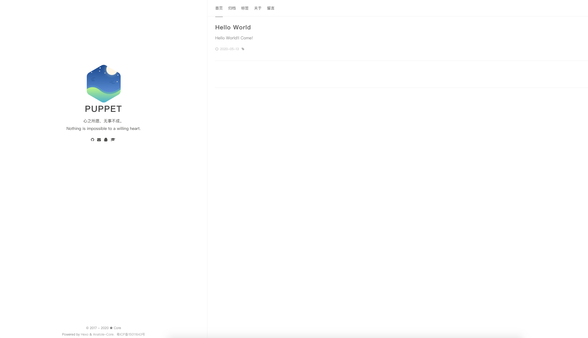
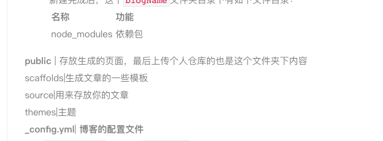

# 一、前言  
之前一直使用CSDN来着，还有有些限制。后来想自己写MarkDown文件放到个人仓库里，之后就开始了自己搭建博客。本文基于Mac系统。
# 二、Hexo 简介  
Hexo是一款基于Node.js的静态博客框架，依赖少易于安装使用，可以方便的生成静态网页托管在GitHub上，是搭建博客的首选框架。而且Hexo对中文的支持非常好。  
"快速、简洁且高效的博客框架"这是它官网上的标语。  
Hexo官网地址：[https://hexo.io/](https://hexo.io/)  
# 三、搭建及发布  
## 安装及发布步骤   
1. 安装Git  
2. 安装Node.js  
3. 安装Hexo  
4. GitHub创建个人仓库  
5. 将hexo部署到GitHub上  
6. 设置个人域名  

##  安装Git   
Mac系统自带Git，可以在终端输入`git --version`看是否已安装，若未安装则在官网上下载安装包安装。  
git官网地址：[https://git-scm.com/](https://git-scm.com/)  
## 安装Node.js  
Hexo 是基于nodeJS编写的，所以要安装一下nodeJS和里面的npm工具。  
Nodejs官网：[https://nodejs.org/en/](https://nodejs.org/en/)  
从官网上下载安装包安装。之后可用如下命令校验是否安装成功：  
```
node -v
npm -v
```
## 安装Hexo  
先创建一个文件夹blog，然后`cd`到这个文件夹下，再输入如下命令：  
```
npm install -g hexo-cli
```
依旧用`hexo -v`查看一下版本，至此安装完成。
### 初始化一下hexo  
命令：`hexo init blogName`  
blogName自己随意取名。  
新建完成后，这个`blogName`文件夹目录下有如下文件目录：  

名称|功能
:---|:---
node_modules|依赖包  
public|存放生成的页面，最后上传个人仓库的也是这个文件夹下内容
scaffolds|生成文章的一些模板
source|用来存放你的文章
themes|主题  
_config.yml|博客的配置文件  

之后` cd bolgName`进入这个`blogName`文件夹。

```
hexo g | hexo generate
hexo s | hexo server
```
最后可以使用如上命令打开hexo服务，在浏览器里输入`localhost:4000`就可以看到生成的博客了。最后使用`ctrl+c`关闭服务。
## GitHub创建个人仓库
1. 首先注册一个GitHub账号。
2. 注册并登录后，点击`New respository`，新建仓库
3. 仓库名称为"`你的用户名+.github.io`"，比如你的用户名为`lee`，则创建的仓库名为`lee.github.io`

## 将Hexo部署到GitHub上
这一步主要是将hexo和Github关联起来，也就是将hexo生成的文章部署到GitHub上，打开配置文件`_config.yml`，滑到最后，个性如下内容
```
deploy:
  type: git
  repo: https://github.com/yourName/yourName.github.io.git
  branch: master
```
之后需要安装`deploy-git`，也就是hexo的部署命令，这样才能用命令将内容部署到GitHub上。
```
npm install hexo-deployer-git --save
```
然后
```
hexo d | hexo deploy
```
hexo基本命令：  

命令|功能
:---|:---
hexo clean|清除之前生成的静态文章等
hexo generate|生成静态文章
hexo deploy|部署文章  

过一会儿之后就可以`https://yourName.github.io`这个网站看到你的博客了！
## 设置个人域名
去阿里云或腾讯云上去买一个域名，需要花钱，未设置。  

# 四、Hexo 配置

##  hexo基本配置
在文件根目录下的`_config.yml`就是整个hexo框架的配置文件了。可以在里面个性大部分配置。
详细见官网：[https://hexo.io/zh-cn/docs/configuration](https://hexo.io/zh-cn/docs/configuration)
### 网站  
参数|描述
:--- | :---
title|网站标题
subtitle|网站副标题
description|网站描述
keywords|网站的关键词。使用半角逗号 , 分隔多个关键词。
author|您的名字
language|网站使用的语言。对于简体中文用户来说，使用不同的主题可能需要设置成不同的值，请参考你的主题的文档自行设置，常见的有 zh-Hans和 zh-CN。
timezone|网站时区。Hexo 默认使用您电脑的时区。请参考 时区列表 进行设置，如 America/New_York, Japan, 和 UTC 。一般的，对于中国大陆地区可以使用 Asia/Shanghai。  

其中，description主要用于SEO，告诉搜索引擎一个关于您站点的简单描述，通常建议在其中包含您网站的关键词。author参数用于主题显示文章的作者。
### 网址

参数|描述|默认值
:---|:---|:---
url|网址|
root|网站根目录|
permalink|文章的**永久链接**格式|:year/:month/:day/:title/
permalink_defaults|永久链接中各部分的默认值|
pretty_urls|改写 permalink 的值来美化 URL|
pretty_urls.trailing_index|是否在永久链接中保留尾部的 index.html，设置为 false 时去除|true
pretty_urls.trailing_html|是否在永久链接中保留尾部的 .html, 设置为 false 时去除 (对尾部的 index.html无效)|true  

**`permalink`**，也就是你生成某个文章时的那个链接格式。
比如说新建一个文件`temp.md`，那么这个时候他自动生成的地址就是`http://yoursite.com/2020/05/13/temp`
详细见官网：[https://hexo.io/zh-cn/docs/permalinks](https://hexo.io/zh-cn/docs/permalinks)

### 目录

|参数 | 描述 | 默认值|
|:---- |:---- | :----|
| source_dir | 资源文件夹，这个文件夹用来存放内容。| source |
public_dir|公共文件夹，这个文件夹用于存放生成的站点文件。|public
tag_dir|标签文件夹|tags
archive_dir|归档文件夹|archives
category_dir|分类文件夹|categories
code_dir|Include code 文件夹，source_dir 下的子目录|downloads/code
i18n_dir|国际化（i18n）文件夹|:lang
skip_render|跳过指定文件的渲染。匹配到的文件将会被不做改动地复制到 public 目录中。您可使用 glob 表达式来匹配路径。|  

### Front-matter  
Front-matter 是文件最上方以`---`分隔的区域，用于指定个别文件的变量，举例如下：
```
---
title: Hello World
---
```
以下是预先定义的参数，您可在模板中使用这些参数值并加以利用。

参数|描述|默认值
:---|:---|:---
layout|布局|
title|标题|文章的文件名
date|建立日期|文件建立日期
updated|更新日期|文件更新日期
comments|开启文章的评论功能|true
tags|标签（不适用于分页）|
categories|分类（不适用于分页）|
permalink|覆盖文章网址|
keywords|仅用于 meta 标签和 Open Graph 的关键词（不推荐使用）|  

详细见官网：[https://hexo.io/zh-cn/docs/front-matter](https://hexo.io/zh-cn/docs/front-matter)

## 更换主题
Hexo默认主题为`landscape`，若感觉不好看，可以到官网主题中选择一个喜欢的主题进行修改。官网主题：[https://hexo.io/themes/](https://hexo.io/themes/)
我选择的是：`hexo-theme-Anatole-Core`
效果如下：
  

git地址如下：[https://github.com/mrcore/hexo-theme-Anatole-Core](https://github.com/mrcore/hexo-theme-Anatole-Core)
### 更换主题步骤：
#### 1. 安装
```
git clone https://github.com/mrcore/hexo-theme-Anatole-Core.git themes/anatole-core

或者直接下载主题zip包解压至主题目录下，重命名为anatole-core

# 安装hexo-renderer-pug

npm install hexo-renderer-pug --save
```
#### 2. 配置
修改hexo根目录下的`_config.yml` ： `theme: anatole-core`

其他需要配置的地方请看`themes/anatole-core/_comfig.yml`
#### 3.更新
```
cd themes/anatole-core
git pull
```
## git分支多终端操作

### 1. 原理
由于`hexo d`上传部署到github的其实是hexo编译后的文件，是用来生成网页的，不包含源文件。也就是上传的是在本地目录里自动生成的`.deploy_git`里面,这是个**隐藏文件夹**。
其他文件 ，包括我们写在`source`里面的，和配置文件，主题文件，都没有上传到github
所以可以利用git的分支管理，将源文件上传到github的另一个分支即可。
### 2. 上传分支
1. 在github上新建一个hexo分支  
2. 将hexo分支内容克隆到本地，再把除.git文件夹外内容全部删除
3. 把除了`.deploy_git`外的所有博客源文件全部复制进来。  

**注意：**
 * 复制过来的源文件应该有一个`.gitignore`，用来忽略一些不需要的文件，如果没有的话，自己新建一个，在里面写上如下内容：
```
.DS_Store
Thumbs.db
db.json
*.log
node_modules/
public/
.deploy*/
```

* 若之前克隆过theme中的主题文件，那么应该把主题文件中的`.git`文件夹删掉，因为git不能嵌套上传，最好是显示隐藏文件，检查一下有没有，否则上传的时候会出错，导致你的主题文件无法上传，这样配置在别的电脑上就用不了了。

* *tip: Mac系统显示与隐藏**隐藏文件**快捷键为：`shift + command + .`*

4. 之后将新内容提交到github，可使用如下命令：
```
git add .
git commit –m "add hexo"
git push 
```
这样就上传完成了，其中`node_modules`、`public`、`db.json`已经被忽略掉了，不需要上传。

### 3. 验证
换台电脑，重走一遍之前的安装流程。之后将代码从github上下载下来，重新部署验证。  

## 添加本地图片  
1. 把主页配置文件`_config.yml`里的`post_asset_folder`选项设置为`true`  
2. 在hexo目录下执行`npm install https://github.com/CodeFalling/hexo-asset-image --save`安装一个可以上传本地图片的插件  
3. 之后运行`hexo n mdFileName`来生成md文件，文件位置为`/source/_posts`,文件夹内除了mdFileName.md文件还有一个同名的文件夹
4. 之后若在mdFileName.md中引入图片，要先把图片复制到mdFileName这个文件夹中，然后只需要在mdFileName.md中按照markdown的格式引入图片：``

5. 最后检查一下，运行`hexo g`生成页面后，进入public\年\月\日\mdFileName.html文件中查看相关字段，若html标签内的语句是``，则网页可以正常加载图片。

**注意：** mdFileName是这个md文件的名字，也是同名文件夹的名字。只需要有文件夹名字即可，不需要绝对路径。
*参考：[http://wonder4.me/2017/02/20/Using-Local-Image-in-Hexo/](http://wonder4.me/2017/02/20/Using-Local-Image-in-Hexo/)*  

# 五、遇到的问题
## 1. 部署失败
```
FATAL Something's wrong. Maybe you can find the solution here: https://hexo.io/docs/troubleshooting.html
TypeError [ERR_INVALID_ARG_TYPE]: The "mode" argument must be integer. Received an instance of Object
```
**原因：** 之前装的是node14, node版本太高了。
**解决方案：**  换成低版本的node，比如node12.14。
因为是回退版本，所以需要先卸载高版本的node,再安装低版本的node.
官网下载node.pkg安装包的通过如下命令卸载node
```
sudo rm -rf /usr/local/{bin/{node,npm},lib/node_modules/npm,lib/node,share/man/*/node.*}
```
*卸载node参考：[https://www.jianshu.com/p/6dcfc0d3ea40](https://www.jianshu.com/p/6dcfc0d3ea40)*

## 2. 部署失败
```
ERROR Process failed: _posts/使用Hexo安装GitHub个人博客.md
YAMLException: end of the stream or a document separator is expected at line 4, column 1:
    Hexo是一款基于Node.js的静态博客框架，依赖少易于安装使 ... 
    ^
    at generateError (/Users/ltt/projects/puppet16.github.io/node_modules/js-yaml/lib/js-yaml/loader.js:167:10)
    at throwError (/Users/ltt/projects/puppet16.github.io/node_modules/js-yaml/lib/js-yaml/loader.js:173:9)
    at readDocument (/Users/ltt/projects/puppet16.github.io/node_modules/js-yaml/lib/js-yaml/loader.js:1539:5)
    at loadDocuments (/Users/ltt/projects/puppet16.github.io/node_modules/js-yaml/lib/js-yaml/loader.js:1575:5)
```
**原因：** md文件要加一个title和date的头
**解决方案：** 在md文件开始位置添加如下代码：
```
---
title: Hello World
date: 2013/7/13 20:46:25
---
```
## 3. 表格显示错误  

显示效果如图：

**原因：** 未严格按照表格格式书写，没有加对齐方式
**解决方案：** 添加对齐方式  
## 4. 表格显示过多  

**问题：** 表格下一行的文字也算成了表格  
**原因：** 在表格最后一行没有两个空格  
**解决方案：** 在表格最后一行添加两个空格表示换行,再回车加一个空行  

## 5. No Layout

**问题：**在多端操作时执行`hexo g`时警告：WARN  No layout: index.html

**原因1：**缺少必要插件

**解决文案：**运行命令`npm ls --depth 0`，以获取相关插件信息，如下图


可以看出缺少图片相关插件，使用相应命令安装上即可。

**原因2：**所用的主题文件是空，主题这个git仓库和hexo博客目录的Git仓库产生嵌套的冲突

**解决方案：**

---
*搭建Hexo参考文章：[https://blog.csdn.net/sinat_37781304/article/details/82729029

](https://blog.csdn.net/sinat_37781304/article/details/82729029)*
*Hexo常用命令参考：[https://www.jianshu.com/p/a2d298e26dcd](https://www.jianshu.com/p/a2d298e26dcd)*