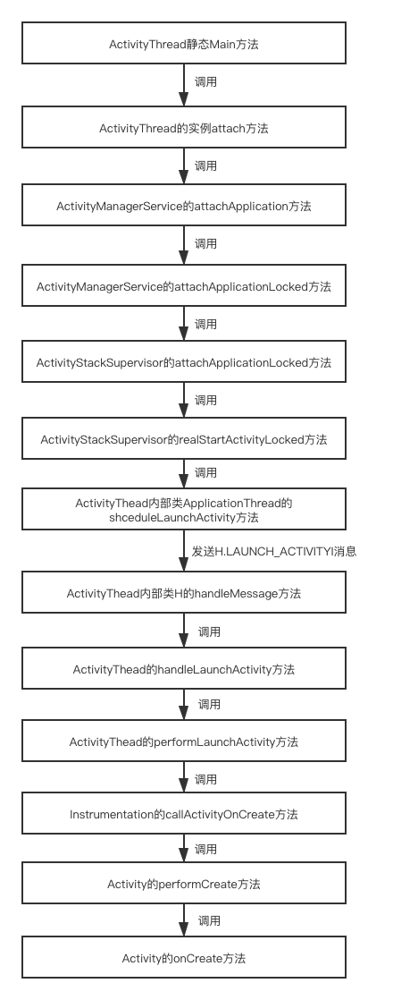

<!-- toc -->

# 一、前言

1. 本文主要讲述：**ActivityThread的理解**
2. 源码基于 **Android API 28**，即**Oreo 8.0.0_r4**
3. 在线查看源码建议使用：[http://androidxref.com/](http://androidxref.com/)
4. 源码系列文章：
    *   
    * 

# 二、 ActivityThread

`ActivityThread`就是我们常说的主线程或UI线程，但他并不是一个`Thread`类。
`ActivityThread`的`main`方法是整个APP的入口，它管理应用程序进程中主线程的执行，调度和执行`Activity`、`Broadcasts`以及`Activity manager`请求的其他操作。
Java程序初始类中的main()方法，将作为该程序初始线程的起点，任何其他的线程都是由这个初始线程启动的。这个线程就是程序的主线程。
简略代码如下：

```java
/**
 * This manages the execution of the main thread in an
 * application process, scheduling and executing activities,
 * broadcasts, and other operations on it as the activity
 * manager requests.
 * {@hide}
 */
public final class ActivityThread {
    ...
    final ApplicationThread mAppThread = new ApplicationThread();
    final Looper mLooper = Looper.myLooper();
    final H mH = new H();
    final ArrayMap<IBinder, ActivityClientRecord> mActivities = new ArrayMap<>();
    final ArrayMap<IBinder, Service> mServices = new ArrayMap<>();
    ...
    private class ApplicationThread extends IApplicationThread.Stub {
        ...
    }
    private class H extends Handler {
        ...
    }
    public static void main(String[] args) {
        ...
    }
}
```

## 1. ActivityThread的初始化

`ActivityThread`即`Android`的主线程，也就是**UI线程**，`ActivityThread`的`main`方法是一个APP的真正入口，`MainLooper`在它的`main`方法中被创建。  

```java
package android.app;
//ActivityThread.java
public static void main(String[] args) {
        ...
        Looper.prepareMainLooper();
        ActivityThread thread = new ActivityThread();
        //在attach方法中完成Application对象的初始化，然后调用Application的onCreate()方法
        thread.attach(false);

        if (sMainThreadHandler == null) {
            sMainThreadHandler = thread.getHandler();
        }
        ...
        Looper.loop();
        throw new RuntimeException("Main thread loop unexpectedly exited");
    }
```

## 2. MainLooper的初始化
在第1节中`ActivityThread`的`main`方法中调用`Looper.prepareMainLooper()`初始化主线程Looper。相关代码如下：

```java
package android.os;
///frameworks/base/core/java/android/os/Looper.java

//一般线程Looper的初始化
public static void prepare() {
    prepare(true);
}

//主线程Looper的初始化
public static void prepareMainLooper() {
    prepare(false);
    synchronized (Looper.class) {
        if (sMainLooper != null) {
            throw new IllegalStateException("The main Looper has already been prepared.");
        }
        sMainLooper = myLooper();
    }
}

private static void prepare(boolean quitAllowed) {
    if (sThreadLocal.get() != null) {
        throw new RuntimeException("Only one Looper may be created per thread");
    }
    sThreadLocal.set(new Looper(quitAllowed));
}

/**
 * Returns the application's main looper, which lives in the main thread of the application.
 */
public static Looper getMainLooper() {
    synchronized (Looper.class) {
        return sMainLooper;
    }
}

public void quit() {
    mQueue.quit(false);
}

public void quitSafely() {
    mQueue.quit(true);
}
```

其中一般线程与主线程Looper初始化区别：

1. **主线程Looper** 初始化之后，赋值给了成员变量`sMainLooper`，这个成员变量的作用就是向其他线程提供**主线程的Looper** 对象。可以通过`Looper.getMainLooper()`方法能获取**主线程的Looper**对象

2. **主线程Looper**初始化与**一般线程Looper**初始化时都调用了`prepare(boolean quitAllowed)`方法，只是**一般线程Looper**初始化时`quitAllowed`值传的`true`，而**主线程Looper传入**的`false`。

    ```java
    package java.lang;
    //libcore/ojluni/src/main/java/java/lang/ThreadLocal.java
    public void set(T value) {
        Thread t = Thread.currentThread();
        ThreadLocalMap map = getMap(t);
        if (map != null)
            map.set(this, value);
        else
            createMap(t, value);
    }
    ```

    可以看到`prepare(boolean quitAllowed)`方法只是创建一个`Looper`，追踪代码后会发现`Looper`最终会放到`Thread`的`ThreadLocalMap`中。  

    ```java
    private Looper(boolean quitAllowed) {
        mQueue = new MessageQueue(quitAllowed);
        mThread = Thread.currentThread();
    }

    ```

    追踪代码可以看到`quitAllowed`参数传入`MessageQueue`中，而`Looper`的`quit()`方法也是调用的`MessageQueue`的`quit()`方法，在其quit方法中判断`mQuitAllowed`，若是主线程Looper则报错。  

    ```java
    package android.os;
    //MessageQueue.java
    void quit(boolean safe) {
        if (!mQuitAllowed) {
            throw new IllegalStateException("Main thread not allowed to quit.");
        }
        ...
    }

    ```

## 3. 主线程Handler的初始化

在`ActivityThread`类中的`main`方法中调用了如下语句：

```java
ActivityThread thread = new ActivityThread();
//在attach方法中完成Application对象的初始化，然后调用Application的onCreate()方法
thread.attach(false);

if (sMainThreadHandler == null) {
    sMainThreadHandler = thread.getHandler();
}
```

可以看到，直接获取主线程Handler，相关代码如下：

```java
final H mH = new H();
final Handler getHandler() {
    return mH;
}
```

由以上代码可知：**主线程的Handler**作为`ActivityThread`的成员变量，是在`ActivityThread`的`main`方法被执行时，`ActivityThread`被创建而初始化。
**小结：** 主线程（ActivityThread）的初始化是在它的`main`方法中，主线程的`Handler`以及`MainLooper`的初始化时机都是在`ActivityThread`创建的时候。

## 4. ApplicationThread及Activity的创建和启动

在`ActivityThread`类中的`main`方法中调用了如下语句：

```java
ActivityThread thread = new ActivityThread();
thread.attach(false);
```

### 1. `thread.attach(false)`相关代码如下：  

```java
package android.app;
//ActivityThread.java
private void attach(boolean system) {
    sCurrentActivityThread = this;
    mSystemThread = system;
    if (!system) {
        ...
        final IActivityManager mgr = ActivityManager.getService();
        try {
            mgr.attachApplication(mAppThread);
        } catch (RemoteException ex) {
            throw ex.rethrowFromSystemServer();
        }
        ...
    } else {
        ...
    }
    ...
}
```

### 2. `ActivityManagerService`相关代码如下：

```java
package com.android.server.am;
//ActivityManagerService.java

@Override
public final void attachApplication(IApplicationThread thread) {
    synchronized (this) {
        int callingPid = Binder.getCallingPid();
        final long origId = Binder.clearCallingIdentity();
        attachApplicationLocked(thread, callingPid);
        Binder.restoreCallingIdentity(origId);
    }
}

private final boolean attachApplicationLocked(IApplicationThread thread, int pid) {
    ...
    if (app.instr != null) {
        thread.bindApplication(...);
    } else {
        thread.bindApplication(...);
    }
    ...
    if (mStackSupervisor.attachApplicationLocked(app)) {
        didSomething = true;
    }
    ...
}
```

在每个`ActivityThread（APP）`被创建的时候，都需要向`ActivityManagerService`绑定（或者说是向远程服务AMS注册自己），用于AMS管理`ActivityThread`中的所有四大组件的生命周期。  

### 3. **`thread.bindApplication`：** 

主要用于创建`Application`，这里的`thread`对象是`ApplicationThread`在`AMS`中的代理对象，所以这里的`bindApplication`方法最终会调用`ApplicationThread.bindApplication()`方法，该方法会向`ActivityThread`的消息对列发送`BIND_APPLICATION`的消息，消息的处理最终会调用`Application.onCreate()`方法，这也说明`Application.onCreate()`方法的执行时机比任何`Activity.onCreate()`方法都早。

```java
//ActivityThread#ApplicationThread
public final void bindApplication(...) {
    ...
    sendMessage(H.BIND_APPLICATION, data);
}
```
该方法会发送消息给主线程Handler，然后主线程Handler会调用`ActivityThread`的`handleBindApplication()`方法。
```java
//ActivityThread.java
private void handleBindApplication(AppBindData data) {
    ...
    try {
        Application app = data.info.makeApplication(data.restrictedBackupMode, null);
        mInitialApplication = app;
        ...
        try {
            mInstrumentation.callApplicationOnCreate(app);
        } catch (Exception e) {
            ...
        }
    } finally {
        ...
    }
    ...
}
```

`data.info`为`LoadedApk`的对象，`LoadedApk`的`makeApplication`方法如下：

```java
package android.app;
///frameworks/base/core/java/android/app/LoadedApk.java

public Application makeApplication(boolean forceDefaultAppClass, Instrumentation instrumentation) {
    if (mApplication != null) {
        return mApplication;
    }
    Application app = null;
    ...
    ContextImpl appContext = ContextImpl.createAppContext(mActivityThread, this);
        app = mActivityThread.mInstrumentation.newApplication(
                cl, appClass, appContext);
        appContext.setOuterContext(app);
    ...
    mApplication = app;
    if (instrumentation != null) {
        try {
            //调用Application的onCreate方法
            instrumentation.callApplicationOnCreate(app);
        } catch (Exception e) {
            ...
        }
    }
    ...
    return app;
}
```

然后调用`Instrumentation`的`newApplication`方法如下：

```java
package android.app;
///frameworks/base/core/java/android/app/Instrumentation.java

static public Application newApplication(Class<?> clazz, Context context) throws InstantiationException, IllegalAccessException, ClassNotFoundException {
    Application app = (Application)clazz.newInstance();
    app.attach(context);
    return app;
}
```

再调用`Application`的`attach`方法

```java
package android.app;
///frameworks/base/core/java/android/app/Application.java

final void attach(Context context) {
    attachBaseContext(context);
    mLoadedApk = ContextImpl.getImpl(context).mPackageInfo;
}
```

### 4. 再回到第2节的 **`mStackSupervisor.attachApplicationLocked(app)`：** 

该方法用于创建`Activity`，`mStackSupervisor`是`AMS`的成员变量，为`Activity`堆栈管理辅助类实例。

```java
package com.android.server.am;
// /frameworks/base/services/core/java/com/android/server/am/ActivityStackSupervisor.java
boolean attachApplicationLocked(ProcessRecord app) throws RemoteException {
    boolean didSomething = false;
    ...
    try {
        if (realStartActivityLocked(hr, app, true, true)) {
            didSomething = true;
        }
    } catch (RemoteException e) {
        ...
    }
    ...
    return didSomething;
}

final boolean realStartActivityLocked(ActivityRecord r, ProcessRecord app, boolean andResume, boolean checkConfig) throws RemoteException {
    ...
    try {
        app.thread.scheduleLaunchActivity(...);
    } catch (RemoteException e) {
        ...
    }
    ...
}
```

`attachApplicationLocked()`方法调用了`realStartActivityLocked()`方法，在`realStartActivityLocked()`方法内处理启动Activity逻辑。`realStartActivityLocked()`方法中首先会准备启动`Activity`的参数信息，准备完毕后调用`ApplicationThread`的`scheduleLaunchActivity`方法

```java
//ActivityThread.java
public final void scheduleLaunchActivity(Intent intent, IBinder token, int ident,
        ActivityInfo info, Configuration curConfig, Configuration overrideConfig,
        CompatibilityInfo compatInfo, String referrer, IVoiceInteractor voiceInteractor,
        int procState, Bundle state, PersistableBundle persistentState,
        List<ResultInfo> pendingResults, List<ReferrerIntent> pendingNewIntents,
        boolean notResumed, boolean isForward, ProfilerInfo profilerInfo) {

    updateProcessState(procState, false);

    ActivityClientRecord r = new ActivityClientRecord();

    r.token = token;
    r.ident = ident;
    r.intent = intent;
    r.referrer = referrer;
    r.voiceInteractor = voiceInteractor;
    r.activityInfo = info;
    r.compatInfo = compatInfo;
    r.state = state;
    r.persistentState = persistentState;

    r.pendingResults = pendingResults;
    r.pendingIntents = pendingNewIntents;

    r.startsNotResumed = notResumed;
    r.isForward = isForward;

    r.profilerInfo = profilerInfo;

    r.overrideConfig = overrideConfig;
    updatePendingConfiguration(curConfig);

    sendMessage(H.LAUNCH_ACTIVITY, r);
}
```

`scheduleLaunchActivity()`方法对启动的信息进行准备，然后通过`sendMessage()`方法发送一个消息，`ActivityThread`的内部类`H`即*主线程Handler*进行接收并处理

```java
//ActivityThread.java
private class H extends Handler {
    public static final int LAUNCH_ACTIVITY         = 100;
    public void handleMessage(Message msg) {
        if (DEBUG_MESSAGES) Slog.v(TAG, ">>> handling: " + codeToString(msg.what));
        switch (msg.what) {
            case LAUNCH_ACTIVITY: {
                Trace.traceBegin(Trace.TRACE_TAG_ACTIVITY_MANAGER, "activityStart");
                final ActivityClientRecord r = (ActivityClientRecord) msg.obj;

                r.packageInfo = getPackageInfoNoCheck(
                        r.activityInfo.applicationInfo, r.compatInfo);
                handleLaunchActivity(r, null, "LAUNCH_ACTIVITY");
                Trace.traceEnd(Trace.TRACE_TAG_ACTIVITY_MANAGER);
            } break;
        ...
        }
    }
```

然后调用`handleLaunchActivity()`方法

```java
private void handleLaunchActivity(ActivityClientRecord r, Intent customIntent, String reason {
    ...
    Activity a = performLaunchActivity(r, customIntent);
    ...
}
```

`performLaunchActivity()`方法真正处理`Activity`的具体启动逻辑

```java

private Activity performLaunchActivity(ActivityClientRecord r, Intent customIntent) {
    // System.out.println("##### [" + System.currentTimeMillis() + "] ActivityThread.performLaunchActivity(" + r + ")");

    ActivityInfo aInfo = r.activityInfo;
    if (r.packageInfo == null) {
        r.packageInfo = getPackageInfo(aInfo.applicationInfo, r.compatInfo,
                Context.CONTEXT_INCLUDE_CODE);
    }

    ComponentName component = r.intent.getComponent();
    if (component == null) {
        component = r.intent.resolveActivity(
            mInitialApplication.getPackageManager());
        r.intent.setComponent(component);
    }

    if (r.activityInfo.targetActivity != null) {
        component = new ComponentName(r.activityInfo.packageName,
                r.activityInfo.targetActivity);
    }

    ContextImpl appContext = createBaseContextForActivity(r);
    Activity activity = null;
    try {
        java.lang.ClassLoader cl = appContext.getClassLoader();
        activity = mInstrumentation.newActivity(
                cl, component.getClassName(), r.intent);
        StrictMode.incrementExpectedActivityCount(activity.getClass());
        r.intent.setExtrasClassLoader(cl);
        r.intent.prepareToEnterProcess();
        if (r.state != null) {
            r.state.setClassLoader(cl);
        }
    } catch (Exception e) {
        if (!mInstrumentation.onException(activity, e)) {
            throw new RuntimeException(
                "Unable to instantiate activity " + component
                + ": " + e.toString(), e);
        }
    }

    try {
        Application app = r.packageInfo.makeApplication(false, mInstrumentation);

        if (localLOGV) Slog.v(TAG, "Performing launch of " + r);
        if (localLOGV) Slog.v(
                TAG, r + ": app=" + app
                + ", appName=" + app.getPackageName()
                + ", pkg=" + r.packageInfo.getPackageName()
                + ", comp=" + r.intent.getComponent().toShortString()
                + ", dir=" + r.packageInfo.getAppDir());

        if (activity != null) {
            CharSequence title = r.activityInfo.loadLabel(appContext.getPackageManager());
            Configuration config = new Configuration(mCompatConfiguration);
            if (r.overrideConfig != null) {
                config.updateFrom(r.overrideConfig);
            }
            if (DEBUG_CONFIGURATION) Slog.v(TAG, "Launching activity "
                    + r.activityInfo.name + " with config " + config);
            Window window = null;
            if (r.mPendingRemoveWindow != null && r.mPreserveWindow) {
                window = r.mPendingRemoveWindow;
                r.mPendingRemoveWindow = null;
                r.mPendingRemoveWindowManager = null;
            }
            appContext.setOuterContext(activity);
            activity.attach(appContext, this, getInstrumentation(), r.token,
                    r.ident, app, r.intent, r.activityInfo, title, r.parent,
                    r.embeddedID, r.lastNonConfigurationInstances, config,
                    r.referrer, r.voiceInteractor, window, r.configCallback);

            if (customIntent != null) {
                activity.mIntent = customIntent;
            }
            r.lastNonConfigurationInstances = null;
            checkAndBlockForNetworkAccess();
            activity.mStartedActivity = false;
            int theme = r.activityInfo.getThemeResource();
            if (theme != 0) {
                activity.setTheme(theme);
            }

            activity.mCalled = false;
            if (r.isPersistable()) {
                mInstrumentation.callActivityOnCreate(activity, r.state, r.persistentState);
            } else {
                mInstrumentation.callActivityOnCreate(activity, r.state);
            }
            if (!activity.mCalled) {
                throw new SuperNotCalledException(
                    "Activity " + r.intent.getComponent().toShortString() +
                    " did not call through to super.onCreate()");
            }
            r.activity = activity;
            r.stopped = true;
            if (!r.activity.mFinished) {
                activity.performStart();
                r.stopped = false;
            }
            if (!r.activity.mFinished) {
                if (r.isPersistable()) {
                    if (r.state != null || r.persistentState != null) {
                        mInstrumentation.callActivityOnRestoreInstanceState(activity, r.state,
                                r.persistentState);
                    }
                } else if (r.state != null) {
                    mInstrumentation.callActivityOnRestoreInstanceState(activity, r.state);
                }
            }
            if (!r.activity.mFinished) {
                activity.mCalled = false;
                if (r.isPersistable()) {
                    mInstrumentation.callActivityOnPostCreate(activity, r.state,
                            r.persistentState);
                } else {
                    mInstrumentation.callActivityOnPostCreate(activity, r.state);
                }
                if (!activity.mCalled) {
                    throw new SuperNotCalledException(
                        "Activity " + r.intent.getComponent().toShortString() +
                        " did not call through to super.onPostCreate()");
                }
            }
        }
        r.paused = true;

        mActivities.put(r.token, r);

    } catch (SuperNotCalledException e) {
        throw e;

    } catch (Exception e) {
        if (!mInstrumentation.onException(activity, e)) {
            throw new RuntimeException(
                "Unable to start activity " + component
                + ": " + e.toString(), e);
        }
    }

    return activity;
}
```

`mInstrumentation.callActivityOnPostCreate()`方法的调用就会执行对`Activity`的`onCreate`调用
总结其流程如下图：



*参考文章： [https://blog.csdn.net/hzwailll/article/details/85339714](https://blog.csdn.net/hzwailll/article/details/85339714)*

# 三、 附录源码

1. Looper.java：[androidxref.com](http://androidxref.com/8.0.0_r4/xref/frameworks/base/core/java/android/os/Looper.java)；[本地](./Looper.java)
2. LoadedApk.java：[androidxref.com](http://androidxref.com/8.0.0_r4/xref/frameworks/base/core/java/android/app/LoadedApk.java)；[本地](./LoadedApk.java)
3. Application.java：[androidxref.com](http://androidxref.com/8.0.0_r4/xref/frameworks/base/core/java/android/app/Application.java)；[本地](./Application.java)
4. ThreadLocal.java：[androidxref.com](http://androidxref.com/8.0.0_r4/xref/libcore/ojluni/src/main/java/java/lang/ThreadLocal.java)；[本地](./ThreadLocal.java)
5. ActivityThread.java：[androidxref.com](http://androidxref.com/8.0.0_r4/xref/frameworks/base/core/java/android/app/ActivityThread.java)；[本地](./ActivityThread.java)
6. Instrumentation.java：[androidxref.com](http://androidxref.com/8.0.0_r4/xref/frameworks/base/core/java/android/app/Instrumentation.java)；[本地](./Instrumentation.java)
7. ActivityManagerService.java：[androidxref.com](http://androidxref.com/8.0.0_r4/xref/frameworks/base/services/core/java/com/android/server/am/ActivityManagerService.java)；[本地](./ActivityManagerService.java)
8. ActivityStackSupervisor.java：[androidxref.com](http://androidxref.com/8.0.0_r4/xref/frameworks/base/services/core/java/com/android/server/am/ActivityStackSupervisor.java)；[本地](./ActivityStackSupervisor.java)

