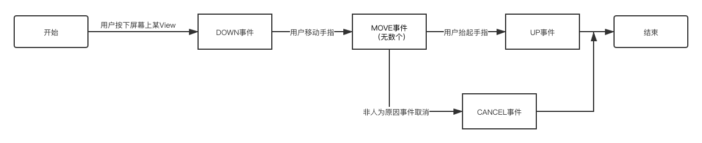
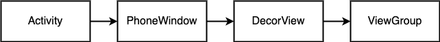
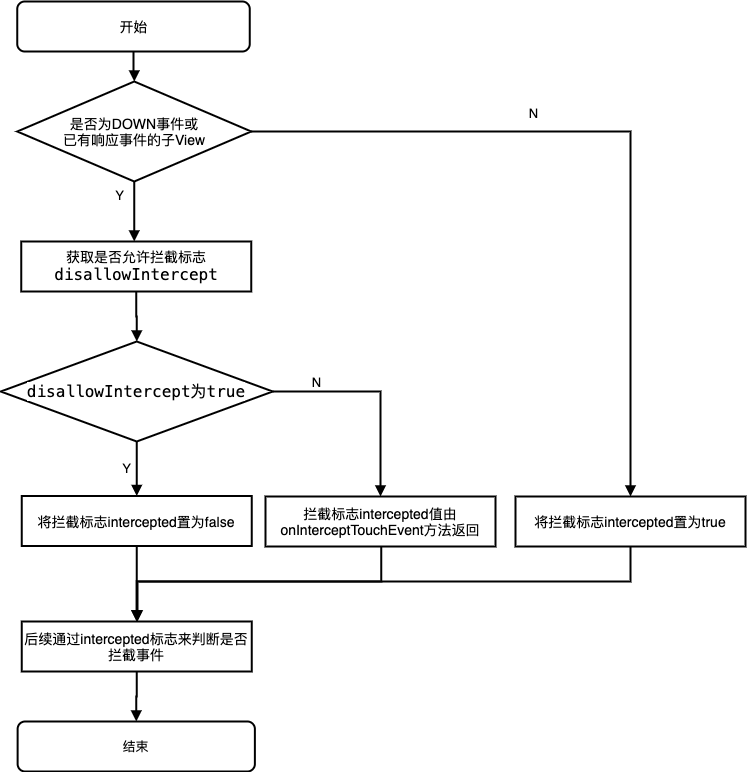
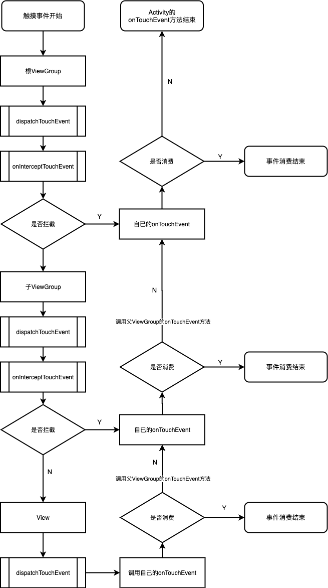

<!-- toc -->

# 一、前言

1. 本文主要讲述**事件分发机制**
2. 源码基于 **Android API 28**，即**Oreo 8.0.0_r4**
3. 在线查看源码建议使用：[http://androidxref.com/](http://androidxref.com/)
4. 源码系列文章：
    * 
    * 
    * 

# 二、事件概述

## 1. 定义

当用户触摸屏幕时，产生的触摸行为（Touch 事件）

## 2. 常用事件类型

* `MotionEvent.ACTION_DOWN`  手指刚接触屏幕
* `MotionEvent.ACTION_UP`  手指从屏幕上松开
* `MotionEvent.ACTION_MOVE`  手指在屏幕上滑动
* `MotionEvent.ACTION_CANCEL`  非人为因素取消

## 3. 事件序列

正常情况下，一次手指触摸屏幕的行为会产生一系列触摸事件
* 点击屏幕后立即松开，事件序列为 DOWN --> UP
* 点击屏幕滑动一会再松开，事件序列为 DOWN --> MOVE --> ... -->MOVE -->UP
   

## 4. 事件分发对象

* Activity: 控制生命周期 & 处理事件
* ViewGroup: 一组 View 的集合（含多个子 View)
* View: 所有 UI 组件的基类

## 5. 事件分发主要方法

* dispatchTouchEvent(MotionEvent ev): 用于进行事件分发
* onInterceptTouchEvent(MotionEvent ev): 判断是否拦截事件（只存在于 ViewGroup 中）
* onTouchEvent(MotionEvent ev): 处理点击事件

# 三、源码分析

## 1. Activity 事件分发

### 1. 当触摸事件触发时会首先调用`Activity`的`dispatchTouchEvent()`方法

源码如下：

```java
package android.app;
// /frameworks/base/core/java/android/app/Activity.java
public class Activity {
    public boolean dispatchTouchEvent(MotionEvent ev) {
        if (ev.getAction() == MotionEvent.ACTION_DOWN) {
            onUserInteraction();
        }
        if (getWindow().superDispatchTouchEvent(ev)) {
            return true;
        }
        return onTouchEvent(ev);
    }
}
```

判断如果是`DOWN`事件，则执行一个空实现的`onUserInteraction()`方法，该方法让子类实现。之后`getWindow()`方法返回`PhoneWindow`对象，调用`PhoneWindow#superDispatchTouchEvent()`方法。

### 2. `PhoneWindow#superDispatchTouchEvent()`

```java
package com.android.internal.policy;
///frameworks/base/core/java/com/android/internal/policy/PhoneWindow.java
public class PhoneWindow extends Window implements MenuBuilder.Callback {
    // This is the top-level view of the window, containing the window decor.
    private DecorView mDecor;

    @Override
    public boolean superDispatchTouchEvent(MotionEvent event) {
        return mDecor.superDispatchTouchEvent(event);
    }
}
```

其中，`mDecor`为`DecorView`对象。

```java
package com.android.internal.policy;
///frameworks/base/core/java/com/android/internal/policy/DecorView.java
public class DecorView extends FrameLayout implements RootViewSurfaceTaker, WindowCallbacks {

    public boolean superDispatchTouchEvent(MotionEvent event) {
        return super.dispatchTouchEvent(event);
    }
}
```

而`DecorView`继承自`FrameLayout`,`FrameLayout`继承自`ViewGroup`，所以最后调用`ViewGroup#dispatchTouchEvent()`方法

由此可知，若`ViewGroup#dispatchTouchEvent()`方法返回`true`，则**第 1 步**中`getWindow().superDispatchTouchEvent(ev)`返回`true`, 则`Activity#dispatchTouchEvent()`返回`true`，事件结束；
若`ViewGroup#dispatchTouchEvent()`方法返回`false`，则`getWindow().superDispatchTouchEvent(ev)`返回`false`, 继续执行`Activity#onTouchEvent()`方法。

```java
public class Activity {
    public boolean onTouchEvent(MotionEvent event) {
        if (mWindow.shouldCloseOnTouch(this, event)) {
            finish();
            return true;
        }
        return false;
    }
}
```

当触摸屏事件未被其下的任何视图处理时调用。如果超出当前`Window`的边界，则关闭当前`Activity`。如果没有超出，则直接返回 false, 事件件结束。

`Activity`的事件分发流程如下图所示：
 

## 2. ViewGroup 事件分发

```java
package android.view;
// /frameworks/base/core/java/android/view/ViewGroup.java
public abstract class ViewGroup extends View implements ViewParent, ViewManager {
    @Override
    public boolean dispatchTouchEvent(MotionEvent ev) {
        ...
        boolean handled = false;
        if (onFilterTouchEventForSecurity(ev)) {
            final int action = ev.getAction();
            final int actionMasked = action & MotionEvent.ACTION_MASK;

            if (actionMasked == MotionEvent.ACTION_DOWN) {
                cancelAndClearTouchTargets(ev);
                resetTouchState();
            }

            // Check for interception.
            final boolean intercepted;
            if (actionMasked == MotionEvent.ACTION_DOWN
                    || mFirstTouchTarget != null) {
                final boolean disallowIntercept = (mGroupFlags & FLAG_DISALLOW_INTERCEPT) != 0;
                if (!disallowIntercept) {
                    intercepted = onInterceptTouchEvent(ev);
                    ev.setAction(action); // restore action in case it was changed
                } else {
                    intercepted = false;
                }
            } else {
                // There are no touch targets and this action is not an initial down
                // so this view group continues to intercept touches.
                intercepted = true;
            }
            ...
            final boolean canceled = resetCancelNextUpFlag(this)
                    || actionMasked == MotionEvent.ACTION_CANCEL;

            // Update list of touch targets for pointer down, if needed.
            final boolean split = (mGroupFlags & FLAG_SPLIT_MOTION_EVENTS) != 0;
            TouchTarget newTouchTarget = null;
            boolean alreadyDispatchedToNewTouchTarget = false;
            if (!canceled && !intercepted) {
                ...
                if (actionMasked == MotionEvent.ACTION_DOWN
                        || (split && actionMasked == MotionEvent.ACTION_POINTER_DOWN)
                        || actionMasked == MotionEvent.ACTION_HOVER_MOVE) {
                    final int actionIndex = ev.getActionIndex(); // always 0 for down
                    final int idBitsToAssign = split ? 1 << ev.getPointerId(actionIndex)
                            : TouchTarget.ALL_POINTER_IDS;

                    removePointersFromTouchTargets(idBitsToAssign);

                    final int childrenCount = mChildrenCount;
                    if (newTouchTarget == null && childrenCount != 0) {
                        ...
                        final View[] children = mChildren;
                        for (int i = childrenCount - 1; i >= 0; i--) {
                            final int childIndex = getAndVerifyPreorderedIndex(
                                    childrenCount, i, customOrder);
                            final View child = getAndVerifyPreorderedView(
                                    preorderedList, children, childIndex);
                            ...
                            if (!canViewReceivePointerEvents(child)
                                    || !isTransformedTouchPointInView(x, y, child, null)) {
                                ev.setTargetAccessibilityFocus(false);
                                continue;
                            }

                            newTouchTarget = getTouchTarget(child);
                            if (newTouchTarget != null) {
                                // Child is already receiving touch within its bounds.
                                // Give it the new pointer in addition to the ones it is handling.
                                newTouchTarget.pointerIdBits |= idBitsToAssign;
                                break;
                            }

                            resetCancelNextUpFlag(child);
                            if (dispatchTransformedTouchEvent(ev, false, child, idBitsToAssign)) {
                                // Child wants to receive touch within its bounds.
                                mLastTouchDownTime = ev.getDownTime();
                                if (preorderedList != null) {
                                    // childIndex points into presorted list, find original index
                                    for (int j = 0; j < childrenCount; j++) {
                                        if (children[childIndex] == mChildren[j]) {
                                            mLastTouchDownIndex = j;
                                            break;
                                        }
                                    }
                                } else {
                                    mLastTouchDownIndex = childIndex;
                                }
                                mLastTouchDownX = ev.getX();
                                mLastTouchDownY = ev.getY();
                                newTouchTarget = addTouchTarget(child, idBitsToAssign);
                                alreadyDispatchedToNewTouchTarget = true;
                                break;
                            }

                            // The accessibility focus didn't handle the event, so clear
                            // the flag and do a normal dispatch to all children.
                            ev.setTargetAccessibilityFocus(false);
                        }
                        if (preorderedList != null) preorderedList.clear();
                    }

                    if (newTouchTarget == null && mFirstTouchTarget != null) {
                        // Did not find a child to receive the event.
                        // Assign the pointer to the least recently added target.
                        newTouchTarget = mFirstTouchTarget;
                        while (newTouchTarget.next != null) {
                            newTouchTarget = newTouchTarget.next;
                        }
                        newTouchTarget.pointerIdBits |= idBitsToAssign;
                    }
                }
            }

            // Dispatch to touch targets.
            if (mFirstTouchTarget == null) {
                // No touch targets so treat this as an ordinary view.
                handled = dispatchTransformedTouchEvent(ev, canceled, null,
                        TouchTarget.ALL_POINTER_IDS);
            } else {
                // Dispatch to touch targets, excluding the new touch target if we already
                // dispatched to it.  Cancel touch targets if necessary.
                TouchTarget predecessor = null;
                TouchTarget target = mFirstTouchTarget;
                while (target != null) {
                    final TouchTarget next = target.next;
                    if (alreadyDispatchedToNewTouchTarget && target == newTouchTarget) {
                        handled = true;
                    } else {
                        final boolean cancelChild = resetCancelNextUpFlag(target.child)
                                || intercepted;
                        if (dispatchTransformedTouchEvent(ev, cancelChild,
                                target.child, target.pointerIdBits)) {
                            handled = true;
                        }
                        if (cancelChild) {
                            if (predecessor == null) {
                                mFirstTouchTarget = next;
                            } else {
                                predecessor.next = next;
                            }
                            target.recycle();
                            target = next;
                            continue;
                        }
                    }
                    predecessor = target;
                    target = next;
                }
            }
        ...
        return handled;
    }

    private void cancelAndClearTouchTargets(MotionEvent event) {
        if (mFirstTouchTarget != null) {
            ...
            clearTouchTargets();
            ...
        }
    }

    private void resetTouchState() {
        clearTouchTargets();
        resetCancelNextUpFlag(this);
        mGroupFlags &= ~FLAG_DISALLOW_INTERCEPT;
        mNestedScrollAxes = SCROLL_AXIS_NONE;
    }

    private void clearTouchTargets() {
        TouchTarget target = mFirstTouchTarget;
        if (target != null) {
            do {
                TouchTarget next = target.next;
                target.recycle();
                target = next;
            } while (target != null);
            mFirstTouchTarget = null;
        }
    }
}
```

一个完整的触摸事件是由`ACTION_DOWN`开始，以`ACTION_UP`结束。则`ACTION_DOWN`事件是一个新的触摸事件的开始，所以判断如果是`ACTION_DOWN`事件，则进行初始化：
* 调用`cancelAndClearTouchTargets()`方法清空`mFirstTouchTarget`，该变量用于存储响应该事件的子`View`的信息；
* 调用`resetTouchState()`方法，清除`mGroupFlags`中存储的`FLAG_DISALLOW_INTERCEPT`标志，该标志用于判断是否允许拦截事件。

之后判断是否拦截除`ACTION_DOWN`之外的其它触摸事件。流程如下图：

 

1. 如果事件为`ACTION_DOWN`事件或者`mFirstTouchTarget`不为空，则通过`mGroupFlags`与标志`FLAG_DISALLOW_INTERCEPT`做位与操作并将结果存入变量`disallowIntercept`用于判断是否不允许拦截事件。其中子`View`可通过`ViewGroup#requestDisallowInterceptTouchEvent()`方法来设置父容器是否能拦截事件。
2. 判断变量`disallowIntercept`如果为`true`，则不允许拦截事件，将标志`intercepted`置为`false`。
3. 若`disallowIntercept`如果为`false`，标志`intercepted`值由方法`onInterceptTouchEvent`方法返回。`onInterceptTouchEvent`方法默认返回`false`，即默认不拦截事件。

如果事件没有取消且没有被拦截，则准备将事件交给子 View 处理。

1. 如果是`ACTION_DOWN`事件，并且事件没有被分发且子 View 数量不为 0，则倒序遍历取出子 View。 
2. 通过`canViewReceivePointerEvents()`方法判断取出的子 View 是否能接收触摸事件（判断条件：**View 是可见的或者 View 没有执行动画，则认为是可接收触摸事件**) 并且通过`isTransformedTouchPointInView()`方法判断子 View 是否在触摸范围内，如果不满足条件，则判断下一个子 View。

```java
private static boolean canViewReceivePointerEvents(@NonNull View child) {
    return (child.mViewFlags & VISIBILITY_MASK) == VISIBLE
            || child.getAnimation() != null;
}

protected boolean isTransformedTouchPointInView(float x, float y, View child,
        PointF outLocalPoint) {
    final float[] point = getTempPoint();
    point[0] = x;
    point[1] = y;
    transformPointToViewLocal(point, child);
    final boolean isInView = child.pointInView(point[0], point[1]);
    if (isInView && outLocalPoint != null) {
        outLocalPoint.set(point[0], point[1]);
    }
    return isInView;
}
```

3. 如果有满足条件的子 View，则执行方法`dispatchTransformedTouchEvent()`并将子 View 作为参数传递进去。

```java
/**
    * Transforms a motion event into the coordinate space of a particular child view,
    * filters out irrelevant pointer ids, and overrides its action if necessary.
    * If child is null, assumes the MotionEvent will be sent to this ViewGroup instead.
    */
private boolean dispatchTransformedTouchEvent(MotionEvent event, boolean cancel,
        View child, int desiredPointerIdBits) {
    final boolean handled;
    ...
    // Perform any necessary transformations and dispatch.
    if (child == null) {
        handled = super.dispatchTouchEvent(transformedEvent);
    } else {
        final float offsetX = mScrollX - child.mLeft;
        final float offsetY = mScrollY - child.mTop;
        transformedEvent.offsetLocation(offsetX, offsetY);
        if (! child.hasIdentityMatrix()) {
            transformedEvent.transform(child.getInverseMatrix());
        }

        handled = child.dispatchTouchEvent(transformedEvent);
    }
    ...
    return handled;
}
```

如果 child 不为空，则调用`child.dispatchTouchEvent(transformedEvent)`，将事件交给子 View 处理，并返回一个布尔型，来判断子 view 是否消费了事件。
如果 child 为空，则调用`ViewGroup`自身的`onTouchEvent()`方法。

4. 如果`dispatchTransformedTouchEvent()`方法返回`true`，则子 View 消费了该事件，接着调用`addTouchTarget()`方法为`newTouchTarget`变量赋值并将`alreadyDispatchedToNewTouchTarget`变量置为`true`。

```java
private TouchTarget addTouchTarget(@NonNull View child, int pointerIdBits) {
    final TouchTarget target = TouchTarget.obtain(child, pointerIdBits);
    target.next = mFirstTouchTarget;
    mFirstTouchTarget = target;
    return target;
}
```

该方法内对变量`mFirstTouchTarget`进行赋值，将其指向消费事件的子 View。

5. `mFirstTouchTarget`不为空表示在`ACTION_DOWN`事件中找到了子 View 消费事件。
   * 判断如果`alreadyDispatchedToNewTouchTarget`为`true`，并且`mFirstTouchTarget`与`newTouchTarget`相等，则`handled`置为`true`，并退出。表示`ACTION_DOWN`事件已分发。
   * 如果以上条件不成立，则是除`ACTION_DOWN`事件以外的其它事件，再通过`dispatchTransformedTouchEvent`方法，将这些事件交给子 View 去处理。

## 2. View 事件分发

```java
package android.view;
// /frameworks/base/core/java/android/view/View.java
public class View implements Drawable.Callback, KeyEvent.Callback,
        AccessibilityEventSource {
    public boolean dispatchTouchEvent(MotionEvent event) {
        ...
        boolean result = false;
        if (onFilterTouchEventForSecurity(event)) {
            if ((mViewFlags & ENABLED_MASK) == ENABLED && handleScrollBarDragging(event)) {
                result = true;
            }
            //noinspection SimplifiableIfStatement
            ListenerInfo li = mListenerInfo;
            if (li != null && li.mOnTouchListener != null
                    && (mViewFlags & ENABLED_MASK) == ENABLED
                    && li.mOnTouchListener.onTouch(this, event)) {
                result = true;
            }

            if (!result && onTouchEvent(event)) {
                result = true;
            }
        }
        ...
        return result;
    }
}

ListenerInfo getListenerInfo() {
    if (mListenerInfo != null) {
        return mListenerInfo;
    }
    mListenerInfo = new ListenerInfo();
    return mListenerInfo;
}

public void setOnTouchListener(OnTouchListener l) {
    getListenerInfo().mOnTouchListener = l;
}
```

1. **如果`View`是`ENABLED`（可见的）** 并且设置了`setOnTouchListener()`监听，且监听的`onTouch()`返回 true，则结果返回`true`。
2. 如果设置了`mOnTouchListener`监听，则只有`mOnTouchListener.onTouch`返回`false`，才会执行`onTouchEvent()`方法。只有`onTouchEvent()`返回`true`，结果才会返回`true`。

```java
public boolean onTouchEvent(MotionEvent event) {
    final float x = event.getX();
    final float y = event.getY();
    final int viewFlags = mViewFlags;
    final int action = event.getAction();

    final boolean clickable = ((viewFlags & CLICKABLE) == CLICKABLE
            || (viewFlags & LONG_CLICKABLE) == LONG_CLICKABLE)
            || (viewFlags & CONTEXT_CLICKABLE) == CONTEXT_CLICKABLE;

    if ((viewFlags & ENABLED_MASK) == DISABLED) {
        if (action == MotionEvent.ACTION_UP && (mPrivateFlags & PFLAG_PRESSED) != 0) {
            setPressed(false);
        }
        mPrivateFlags3 &= ~PFLAG3_FINGER_DOWN;
        // A disabled view that is clickable still consumes the touch
        // events, it just doesn't respond to them.
        return clickable;
    }
    if (mTouchDelegate != null) {
        if (mTouchDelegate.onTouchEvent(event)) {
            return true;
        }
    }

    if (clickable || (viewFlags & TOOLTIP) == TOOLTIP) {
        switch (action) {
            case MotionEvent.ACTION_UP:
                ...
                boolean prepressed = (mPrivateFlags & PFLAG_PREPRESSED) != 0;
                if ((mPrivateFlags & PFLAG_PRESSED) != 0 || prepressed) {
                    // take focus if we don't have it already and we should in
                    // touch mode.
                    boolean focusTaken = false;
                    if (isFocusable() && isFocusableInTouchMode() && !isFocused()) {
                        focusTaken = requestFocus();
                    }

                    if (prepressed) {
                        // The button is being released before we actually
                        // showed it as pressed.  Make it show the pressed
                        // state now (before scheduling the click) to ensure
                        // the user sees it.
                        setPressed(true, x, y);
                    }

                    if (!mHasPerformedLongPress && !mIgnoreNextUpEvent) {
                        // This is a tap, so remove the longpress check
                        removeLongPressCallback();

                        // Only perform take click actions if we were in the pressed state
                        if (!focusTaken) {
                            // Use a Runnable and post this rather than calling
                            // performClick directly. This lets other visual state
                            // of the view update before click actions start.
                            if (mPerformClick == null) {
                                mPerformClick = new PerformClick();
                            }
                            if (!post(mPerformClick)) {
                                performClick();
                            }
                        }
                    }

                    if (mUnsetPressedState == null) {
                        mUnsetPressedState = new UnsetPressedState();
                    }

                    if (prepressed) {
                        postDelayed(mUnsetPressedState,
                                ViewConfiguration.getPressedStateDuration());
                    } else if (!post(mUnsetPressedState)) {
                        // If the post failed, unpress right now
                        mUnsetPressedState.run();
                    }

                    removeTapCallback();
                }
                mIgnoreNextUpEvent = false;
                break;

            case MotionEvent.ACTION_DOWN:
                if (event.getSource() == InputDevice.SOURCE_TOUCHSCREEN) {
                    mPrivateFlags3 |= PFLAG3_FINGER_DOWN;
                }
                mHasPerformedLongPress = false;

                if (!clickable) {
                    checkForLongClick(0, x, y);
                    break;
                }

                if (performButtonActionOnTouchDown(event)) {
                    break;
                }

                // Walk up the hierarchy to determine if we're inside a scrolling container.
                boolean isInScrollingContainer = isInScrollingContainer();

                // For views inside a scrolling container, delay the pressed feedback for
                // a short period in case this is a scroll.
                if (isInScrollingContainer) {
                    mPrivateFlags |= PFLAG_PREPRESSED;
                    if (mPendingCheckForTap == null) {
                        mPendingCheckForTap = new CheckForTap();
                    }
                    mPendingCheckForTap.x = event.getX();
                    mPendingCheckForTap.y = event.getY();
                    postDelayed(mPendingCheckForTap, ViewConfiguration.getTapTimeout());
                } else {
                    // Not inside a scrolling container, so show the feedback right away
                    setPressed(true, x, y);
                    checkForLongClick(0, x, y);
                }
                break;

            case MotionEvent.ACTION_CANCEL:
                if (clickable) {
                    setPressed(false);
                }
                removeTapCallback();
                removeLongPressCallback();
                mInContextButtonPress = false;
                mHasPerformedLongPress = false;
                mIgnoreNextUpEvent = false;
                mPrivateFlags3 &= ~PFLAG3_FINGER_DOWN;
                break;

            case MotionEvent.ACTION_MOVE:
                if (clickable) {
                    drawableHotspotChanged(x, y);
                }

                // Be lenient about moving outside of buttons
                if (!pointInView(x, y, mTouchSlop)) {
                    // Outside button
                    // Remove any future long press/tap checks
                    removeTapCallback();
                    removeLongPressCallback();
                    if ((mPrivateFlags & PFLAG_PRESSED) != 0) {
                        setPressed(false);
                    }
                    mPrivateFlags3 &= ~PFLAG3_FINGER_DOWN;
                }
                break;
        }

        return true;
    }

    return false;
}
```

1. 判断`View`是否可点击：`viewFlags`是否有`CLICKABLE`或`LONG_CLICKABLE`或`CONTEXT_CLICKABLE`。将结果存入变量`clickable`中。
2. 如果`View`是`DISABLED`状态，则返回`clickable`，即 **`View`虽然是不可用的，但是仍然可以消费触摸事件**
3. 如果是可点击的，则根据事件类型做不同处理：
    * `ACTION_DOWN`事件，则将变量`mHasPerformedLongPress`置为`false`，该变量用于判断是否处理了长按事件。之后判断是否处于一个滑动的容器内：
       * 如果在一个滑动容器内，则发送一个一百毫秒的延时任务去检测长按事件。
       * 如果不在一个滑动容器内，则通过方法`checkForLongClick()`直接检测长按事件

          ```java
            private void checkForLongClick(int delayOffset, float x, float y) {
                if ((mViewFlags & LONG_CLICKABLE) == LONG_CLICKABLE || (mViewFlags & TOOLTIP)  == TOOLTIP) {
                    mHasPerformedLongPress = false;
                    if (mPendingCheckForLongPress == null) {
                        mPendingCheckForLongPress = new CheckForLongPress();
                    }
                    mPendingCheckForLongPress.setAnchor(x, y);
                    mPendingCheckForLongPress.rememberWindowAttachCount();
                    mPendingCheckForLongPress.rememberPressedState();
                    postDelayed(mPendingCheckForLongPress,
                            ViewConfiguration.getLongPressTimeout() - delayOffset);
                }
            }
          ```

            该方法主要发送一个五百毫秒的延时任务去检测长按事件。

          ```java

            private final class CheckForLongPress implements Runnable {
                private int mOriginalWindowAttachCount;
                private float mX;
                private float mY;
                private boolean mOriginalPressedState;

                @Override
                public void run() {
                    if ((mOriginalPressedState == isPressed()) && (mParent != null)
                            && mOriginalWindowAttachCount == mWindowAttachCount) {
                        if (performLongClick(mX, mY)) {
                            mHasPerformedLongPress = true;
                        }
                    }
                }
            ...
            }
            public boolean performLongClick() {
                return performLongClickInternal(mLongClickX, mLongClickY);
            }

            public boolean performLongClick(float x, float y) {
                mLongClickX = x;
                mLongClickY = y;
                final boolean handled = performLongClick();
                mLongClickX = Float.NaN;
                mLongClickY = Float.NaN;
                return handled;
            }
          ```

         `CheckForLongPress`类里`run()`方法调用了`performLongClick(float x, float y)`方法，之后该方法最终调用`performLongClickInternal(float x, float y)`方法，在该方法内处理`View`的长按事件。

         ```java
            private boolean performLongClickInternal(float x, float y) {
                sendAccessibilityEvent(AccessibilityEvent.TYPE_VIEW_LONG_CLICKED);

                boolean handled = false;
                final ListenerInfo li = mListenerInfo;
                if (li != null && li.mOnLongClickListener != null) {
                    handled = li.mOnLongClickListener.onLongClick(View.this);
                }
                if (!handled) {
                    final boolean isAnchored = !Float.isNaN(x) && !Float.isNaN(y);
                    handled = isAnchored ? showContextMenu(x, y) : showContextMenu();
                }
                if ((mViewFlags & TOOLTIP) == TOOLTIP) {
                    if (!handled) {
                        handled = showLongClickTooltip((int) x, (int) y);
                    }
                }
                if (handled) {
                    performHapticFeedback(HapticFeedbackConstants.LONG_PRESS);
                }
                return handled;
            }
         ```

            该方法内处理长按事件，先判断是否设置`mOnLongClickListener`监听器，如果设置了监听器，则长按事件处理结果为监听器内`onLongClick()`方法的返回值。
            如果返回`true`，则`performLongClick(float x, float y)`方法返回`true`，则将变量`mHasPerformedLongPress`置为`true`
    * `ACTION_UP`事件，判断`mHasPerformedLongPress`值。
        * 如果`mHasPerformedLongPress`值为`false`, 即没有处理长按事件且没有忽略`ACTION_UP`事件，则通过`removeLongPressCallback()`方法，将之前的检测长按事件的延时任务关闭，表示从`DOWN`事件到`UP`事件之间少于**五百毫秒**。之后通过`PerformClick`类响应点击事件。

            ```java

                private final class PerformClick implements Runnable {
                    @Override
                    public void run() {
                        performClick();
                    }
                }
                public boolean performClick() {
                    final boolean result;
                    final ListenerInfo li = mListenerInfo;
                    if (li != null && li.mOnClickListener != null) {
                        playSoundEffect(SoundEffectConstants.CLICK);
                        li.mOnClickListener.onClick(this);
                        result = true;
                    } else {
                        result = false;
                    }
                    ...
                    return result;
                }
            ```

            在`performClick()`方法中处理点击事件，先判断是否设置`mOnClickListener`监听器，如果设置了监听器，则长按事件处理结果为监听器内`onClick()`方法的返回值。
        * 如果`mHasPerformedLongPress`值为`true`, 即如果添加了`mOnLongClickListener`监听器，且`onLongClick()`方法返回了`true`，则不会执行`onClick`事件。

# 四、总结

1. 一个事件序列从手指接触屏幕到手指离开屏幕，在这个过程中产生一系列事件，以`DOWN`事件开始，中间含有不定数的`MOVE`事件，以`UP`事件结束。
2. 正常情况下，一个事件序列只能被一个 View 拦截并且消费。
3. 某个 View 一旦决定拦截，那么这个事件序列都将由它的`onTouchEvent`处理，并且它的`onInterceptTouchEvent`不会再调用。
4. 某个 View 一旦开始处理事件，如果它不消费`ACTION_DOWN`事件 (`onTouchEvent`事件返回`false`)，那么同一事件序列中其它事件都不会再交给它处理。并且重新由它的父元素处理（父元素`onTouchEvent`被调用）。
5. 事件传递过程是**由外向内**的，即事件总是先传递给父元素，然后再由父元素分发给子 View，通过`requestDisallowInterceptTouchEvent`方法可以在子 View 中干预父元素的事件分发过程，但`ACTION_DOWN`除外。
6. `ViewGroup`默认不拦截任何事件，即`onInterceptTouchEvent`默认返回`false`。View 没有`onInterceptTouchEvent`方法，一旦有点击事件传递给它，那它的`onTouchEvent`方法就会被调用。
7. View 的`onTouchEvent`默认会消费事件（返回`true`)，除非它是不可点击的 (`clickable`和`longClickable`同时为`false`)。View 的`longClickable`默认都为`false`，clickable 要分情况，比如`Button`的`clickable`默认为`true`,`TextView`的`clickable`默认为`false`。但是设置`setOnClickLinstener`监听器时`View`会自动将`clickable`置为`true`。
8. View 的`enable`属性不影响`onTouchEvent`的默认返回值。哪怕一个 View 是`disable`状态，只要它的`clickable`或`longClickable`有一个为`true`，那么它的`onTouchEvent`就一定返回`true`。
9. `onClick`会响应的前提是当前 View 是可点击的，并且收到了`ACTION_DOWN`和`ACTION_UP`的事件，并且受长按事件影响，当长按事件返回`true`时，`onClick`不会响应。
10. `onLongClick`在`ACTION_DOWN`里判断是否进行响应，要想执行长按事件该 View 必须是`longClickable`的并且设置了`OnLongCLickListener`。

触摸事件整体流程如下图：



# 五、附录

1. Activity.java [http://androidxref.com/](http://androidxref.com/8.1.0_r33/xref/frameworks/base/core/java/android/app/Activity.java)
2. PhoneWindow.java [http://androidxref.com/](http://androidxref.com/8.0.0_r4/xref/frameworks/base/core/java/com/android/internal/policy/PhoneWindow.java)
3. DecorView.java [http://androidxref.com/](http://androidxref.com/8.0.0_r4/xref/frameworks/base/core/java/com/android/internal/policy/DecorView.java)
4. ViewGroup.java：[androidxref.com](http://androidxref.com/8.0.0_r4/xref/frameworks/base/core/java/android/view/ViewGroup.java)
5. View.java [http://androidxref.com/](http://androidxref.com/8.0.0_r4/xref/frameworks/base/core/java/android/view/View.java)
